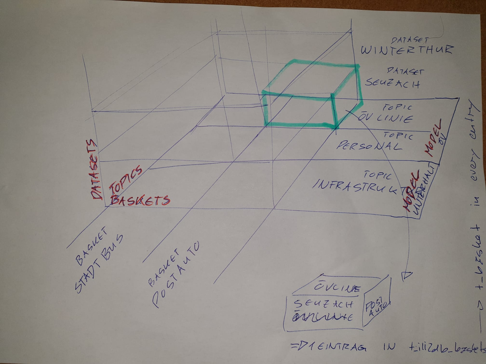

Dave vergleiche das mit Doku und lösche wenn redunant.

## Those baskets and datatsets

Siehe auch:
https://www.geowerkstatt.ch/blog-summary/interlis-2-einfach-vermittelt

### Example

`OeVLinien` **TOPIC** wird in zwei **BASKETs** unterteilt:
```
INTERLIS 2.3;

MODEL OeVBasketTest (en) 
AT "https://signedav.github.io/usabilitydave/models"
VERSION "2020-06-22" =
 
  TOPIC OeVLinien = 

    BASKET OID AS INTERLIS.UUIDOID;

    CLASS SingleLinie  = 
      Bezeichnung : MANDATORY TEXT*99; 
      Code : MANDATORY TEXT*15; 
    END SingleLinie; 

  END OeVLinien;

END OeVBasketTest.
```

#### Wo sind jetzt die Baskets?
Na, hier in der Transferdatei:
```
<?xml version="1.0" encoding="UTF-8"?>
<!-- File OeVBasketTest_DataWithBIDs.xml 2020-06-22 -->
<TRANSFER xmlns="http://www.interlis.ch/INTERLIS2.3" xmlns:xsi="http://www.w3.org/2001/XMLSchema-instance">

    <HEADERSECTION VERSION="2.3" SENDER="https://signedav.github.io/usabilitydave/models">
        <MODELS>
            <MODEL NAME="OeVBasketTest" URI="https://signedav.github.io/usabilitydave/models" VERSION="2020-06-22"/>
        </MODELS>
    </HEADERSECTION>

    <DATASECTION>
        <OeVBasketTest.OeVLinien BID="Postauto">
            <OeVBasketTest.OeVLinien.SingleLinie TID="134"><Bezeichnung>Postauto Winterthur Neftenbach</Bezeichnung><Code>134</Code></OeVBasketTest.OeVLinien.SingleLinie>
            <OeVBasketTest.OeVLinien.SingleLinie TID="135"><Bezeichnung>Postauto Winterthur Rickenbach</Bezeichnung><Code>135</Code></OeVBasketTest.OeVLinien.SingleLinie>
        </OeVBasketTest.OeVLinien>
        <OeVBasketTest.OeVLinien BID="Stadtbus">
            <OeVBasketTest.OeVLinien.SingleLinie TID="1"><Bezeichnung>Winterthur - Töss - Oberwinterthur</Bezeichnung><Code>1</Code></OeVBasketTest.OeVLinien.SingleLinie>
            <OeVBasketTest.OeVLinien.SingleLinie TID="2"><Bezeichnung>Winterthur - Veltheim - Whatever</Bezeichnung><Code>2</Code></OeVBasketTest.OeVLinien.SingleLinie>
        </OeVBasketTest.OeVLinien>
    </DATASECTION>
</TRANSFER>
```
> Selbstverständlich liesse sich eine Gruppierung auch mit einem spezifischen Attribut und einer globalen Aufzählung realisieren. Der Vorteil von Baskets ist jedoch, dass sie das Schema nicht tangieren. Zudem bieten Baskets den Vorteil, dass Import- und Export-Werkzeuge automatisch Konsistenzprüfungen zwischen Klassen (zB. Validierung von Fremdschlüssel-Beziehungen) innerhalb der Gruppe anwenden. Solche Aspekte müssten bei einer Lösung basierend auf spezifischen Attributen zusätzlich formuliert werden.

#### Looks like this on the DB
##### singlelinie
```
daves_bakery=# select * from oev_basks_01.singlelinie;
 t_id | t_ili_tid |            bezeichnung             | acode 
------+-----------+------------------------------------+-------
   21 | 134       | Postauto Winterthur Neftenbach     | 134
   22 | 135       | Postauto Winterthur Rickenbach     | 135
   24 | 1         | Winterthur - Töss - Oberwinterthur | 1
   25 | 2         | Winterthur - Veltheim - Whatever   | 2
```
##### t_ili2db_basket
```
daves_bakery=# select * from oev_basks_01.t_ili2db_basket;
 t_id | dataset |          topic          | t_ili_tid |           attachmentkey           | domains 
------+---------+-------------------------+-----------+-----------------------------------+---------
   20 |      19 | OeVBasketTest.OeVLinien | Postauto  | OeVBasketTest_DataWithBIDs.xtf-20 | 
   23 |      19 | OeVBasketTest.OeVLinien | Stadtbus  | OeVBasketTest_DataWithBIDs.xtf-20 | 
```
##### t_ili2db_dataset
```
daves_bakery=# select * from oev_basks_01.t_ili2db_dataset;
 t_id |            datasetname            
------+-----------------------------------
   19 | OeVBasketTest_DataWithBIDs.xtf-19
```

#### Another import
```
<?xml version="1.0" encoding="UTF-8"?>
<!-- File OeVBasketTest_MoreDataWithBIDs.xml 2020-06-22 -->
<TRANSFER xmlns="http://www.interlis.ch/INTERLIS2.3" xmlns:xsi="http://www.w3.org/2001/XMLSchema-instance">

    <HEADERSECTION VERSION="2.3" SENDER="https://signedav.github.io/usabilitydave/models">
        <MODELS>
            <MODEL NAME="OeVBasketTest" URI="https://signedav.github.io/usabilitydave/models" VERSION="2020-06-22"/>
        </MODELS>
    </HEADERSECTION>

    <DATASECTION>
        <OeVBasketTest.OeVLinien BID="Postauto">
            <OeVBasketTest.OeVLinien.SingleLinie TID="136"><Bezeichnung>Postauto Seuzach Neftenbach</Bezeichnung><Code>134</Code></OeVBasketTest.OeVLinien.SingleLinie>
            <OeVBasketTest.OeVLinien.SingleLinie TID="137"><Bezeichnung>Postauto Seuzach Rickenbach</Bezeichnung><Code>135</Code></OeVBasketTest.OeVLinien.SingleLinie>
        </OeVBasketTest.OeVLinien>
        <OeVBasketTest.OeVLinien BID="Stadtbus">
            <OeVBasketTest.OeVLinien.SingleLinie TID="3"><Bezeichnung>Seuzach - Töss - Oberseuzach</Bezeichnung><Code>1</Code></OeVBasketTest.OeVLinien.SingleLinie>
            <OeVBasketTest.OeVLinien.SingleLinie TID="4"><Bezeichnung>Seuzach - Veltheim - Whatever</Bezeichnung><Code>2</Code></OeVBasketTest.OeVLinien.SingleLinie>
            <OeVBasketTest.OeVLinien.SingleLinie TID="1"><Bezeichnung>Seuzach - Konflikta mit Nummer</Bezeichnung><Code>2</Code></OeVBasketTest.OeVLinien.SingleLinie>
        </OeVBasketTest.OeVLinien>
    </DATASECTION>
</TRANSFER>
```
##### singlelinie
```
daves_bakery=# select * from oev_basks_01.singlelinie;
 t_id | t_ili_tid |            bezeichnung             | acode 
------+-----------+------------------------------------+-------
   21 | 134       | Postauto Winterthur Neftenbach     | 134
   22 | 135       | Postauto Winterthur Rickenbach     | 135
   24 | 1         | Winterthur - Töss - Oberwinterthur | 1
   25 | 2         | Winterthur - Veltheim - Whatever   | 2
   36 | 136       | Postauto Seuzach Neftenbach        | 136
   37 | 137       | Postauto Seuzach Rickenbach        | 137
   39 | 3         | Seuzach - Töss - Oberseuzach       | 3
   40 | 4         | Seuzach - Veltheim - Whatever      | 4
   41 | 1         | Seuzach - Konflikta mit Nummer     | 1
```
##### t_ili2db_basket
```
daves_bakery=# select * from oev_basks_01.t_ili2db_basket;
 t_id | dataset |          topic          | t_ili_tid |             attachmentkey             | domains 
------+---------+-------------------------+-----------+---------------------------------------+---------
   20 |      19 | OeVBasketTest.OeVLinien | Postauto  | OeVBasketTest_DataWithBIDs.xtf-20     | 
   23 |      19 | OeVBasketTest.OeVLinien | Stadtbus  | OeVBasketTest_DataWithBIDs.xtf-20     | 
   35 |      34 | OeVBasketTest.OeVLinien | Postauto  | OeVBasketTest_MoreDataWithBIDs.xtf-35 | 
   38 |      34 | OeVBasketTest.OeVLinien | Stadtbus  | OeVBasketTest_MoreDataWithBIDs.xtf-35 | 
```
##### t_ili2db_dataset
```
daves_bakery=# select * from oev_basks_01.t_ili2db_dataset;
 t_id |              datasetname              
------+---------------------------------------
   19 | OeVBasketTest_DataWithBIDs.xtf-19
   34 | OeVBasketTest_MoreDataWithBIDs.xtf-34
```

### Und was sind jetzt also DATASETs?
Ähm... Files? Import Sessions...

#### Fresh import of the data mit `--dataset test_set_seuzach `
```
java -jar /home/dave/dev/opengisch/QgisModelBaker/QgisModelBaker/libili2db/bin/ili2pg-4.5.0/ili2pg-4.5.0.jar --import --dbhost localhost --dbusr postgres --dbpwd ****** --dbdatabase daves_bakery --dbschema oev_basks_02 --coalesceCatalogueRef --createEnumTabs --createNumChecks --createUnique --createFk --createFkIdx --coalesceMultiSurface --coalesceMultiLine --coalesceMultiPoint --coalesceArray --beautifyEnumDispName --createGeomIdx --createMetaInfo --expandMultilingual --createTypeConstraint --createEnumTabsWithId --createTidCol --importTid --smart2Inheritance --strokeArcs --defaultSrsCode 21781 --models OeVBasketTest --dataset test_set_seuzach /home/dave/dev/gh_signedav/usabilitydave/referencedata/OeVBasketTest_MoreDataWithBIDs.xtf
```

Es gibt einen Fehler:
```
import with dataset name requires column T_basket
```

#### Es braucht bei Schemaimport schon `--createBasketCol`

#### Dann nochmals Import von OeVBasketTest_MoreDataWithBIDs.xtf und `--dataset test_set_seuzach `
##### singlelinie
```
daves_bakery=# select * from oev_basks_04.singlelinie;
 t_id | t_basket | t_ili_tid |          bezeichnung           | acode 
------+----------+-----------+--------------------------------+-------
   11 |       10 | 136       | Postauto Seuzach Neftenbach    | 134
   12 |       10 | 137       | Postauto Seuzach Rickenbach    | 135
   14 |       13 | 3         | Seuzach - Töss - Oberseuzach   | 1
   15 |       13 | 4         | Seuzach - Veltheim - Whatever  | 2
   16 |       13 | 1         | Seuzach - Konflikta mit Nummer | 2
```
##### t_ili2db_basket
```
daves_bakery=# select * from oev_basks_04.t_ili2db_basket;
 t_id | dataset |          topic          | t_ili_tid |             attachmentkey             | domains 
------+---------+-------------------------+-----------+---------------------------------------+---------
   10 |       9 | OeVBasketTest.OeVLinien | Postauto  | OeVBasketTest_MoreDataWithBIDs.xtf-10 | 
   13 |       9 | OeVBasketTest.OeVLinien | Stadtbus  | OeVBasketTest_MoreDataWithBIDs.xtf-10 | 
```
##### t_ili2db_dataset
```
daves_bakery=# select * from oev_basks_04.t_ili2db_dataset;
 t_id | datasetname  
------+--------------
    9 | test_set_seuzach
```

#### Und dann noch OeVBasketTest_DataWithBIDs.xtf und `--dataset test_set_winti`
##### singlelinie
```
daves_bakery=# select * from oev_basks_04.singlelinie;
 t_id | t_basket | t_ili_tid |            bezeichnung             | acode 
------+----------+-----------+------------------------------------+-------
   11 |       10 | 136       | Postauto Seuzach Neftenbach        | 134
   12 |       10 | 137       | Postauto Seuzach Rickenbach        | 135
   14 |       13 | 3         | Seuzach - Töss - Oberseuzach       | 1
   15 |       13 | 4         | Seuzach - Veltheim - Whatever      | 2
   16 |       13 | 1         | Seuzach - Konflikta mit Nummer     | 2
   26 |       25 | 134       | Postauto Winterthur Neftenbach     | 134
   27 |       25 | 135       | Postauto Winterthur Rickenbach     | 135
   29 |       28 | 1         | Winterthur - Töss - Oberwinterthur | 1
   30 |       28 | 2         | Winterthur - Veltheim - Whatever   | 2
```
##### t_ili2db_basket
```
daves_bakery=# select * from oev_basks_04.t_ili2db_basket;
 t_id | dataset |          topic          | t_ili_tid |             attachmentkey             | domains 
------+---------+-------------------------+-----------+---------------------------------------+---------
   10 |       9 | OeVBasketTest.OeVLinien | Postauto  | OeVBasketTest_MoreDataWithBIDs.xtf-10 | 
   13 |       9 | OeVBasketTest.OeVLinien | Stadtbus  | OeVBasketTest_MoreDataWithBIDs.xtf-10 | 
   25 |      24 | OeVBasketTest.OeVLinien | Postauto  | OeVBasketTest_DataWithBIDs.xtf-25     | 
   28 |      24 | OeVBasketTest.OeVLinien | Stadtbus  | OeVBasketTest_DataWithBIDs.xtf-25     | 
```
##### t_ili2db_dataset
```
daves_bakery=# select * from oev_basks_04.t_ili2db_dataset;
 t_id |            datasetname            
------+-----------------------------------
    9 | test_set_seuzach
   24 | test_set_winti
```

(wenn ich kein `--dataset <name>` angegeben hätte, hätte es einfach den Filenamen genommen)

#### import more data of same set (ersetzen)

```
<?xml version="1.0" encoding="UTF-8"?>
<!-- File OeVBasketTest_DataWithBIDs2.xml 2020-06-22 -->
<TRANSFER xmlns="http://www.interlis.ch/INTERLIS2.3" xmlns:xsi="http://www.w3.org/2001/XMLSchema-instance">

    <HEADERSECTION VERSION="2.3" SENDER="https://signedav.github.io/usabilitydave/models">
        <MODELS>
            <MODEL NAME="OeVBasketTest" URI="https://signedav.github.io/usabilitydave/models" VERSION="2020-06-22"/>
        </MODELS>
    </HEADERSECTION>

    <DATASECTION>
        <OeVBasketTest.OeVLinien BID="Postauto">
            <OeVBasketTest.OeVLinien.SingleLinie TID="1342"><Bezeichnung>Postauto Winterthur Zweineften</Bezeichnung><Code>134</Code></OeVBasketTest.OeVLinien.SingleLinie>
            <OeVBasketTest.OeVLinien.SingleLinie TID="1352"><Bezeichnung>Postauto Winterthur Zweiricken</Bezeichnung><Code>135</Code></OeVBasketTest.OeVLinien.SingleLinie>
        </OeVBasketTest.OeVLinien>
        <OeVBasketTest.OeVLinien BID="Stadtbus">
            <OeVBasketTest.OeVLinien.SingleLinie TID="12"><Bezeichnung>Winterthur - Zwei - Oberwinterthur</Bezeichnung><Code>1</Code></OeVBasketTest.OeVLinien.SingleLinie>
            <OeVBasketTest.OeVLinien.SingleLinie TID="22"><Bezeichnung>Winterthur - Zwei - Whatever</Bezeichnung><Code>2</Code></OeVBasketTest.OeVLinien.SingleLinie>
        </OeVBasketTest.OeVLinien>
    </DATASECTION>
</TRANSFER>
```

Import mit `--dataset test_set_winti`, dann kommt:
```
dataset <test_set_winti> already exists
```

Deshalb brauchts `--dataset test_set_winti --replace`

> Fügt neue Records hinzu (löscht bestehende Records des gegebenen Datensatzes)

##### singlelinie
```
daves_bakery=# select * from oev_basks_04.singlelinie;
 t_id | t_basket | t_ili_tid |            bezeichnung             | acode 
------+----------+-----------+------------------------------------+-------
   26 |       25 | 134       | Postauto Winterthur Neftenbach     | 134
   27 |       25 | 135       | Postauto Winterthur Rickenbach     | 135
   29 |       28 | 1         | Winterthur - Töss - Oberwinterthur | 1
   30 |       28 | 2         | Winterthur - Veltheim - Whatever   | 2
   38 |       37 | 1342      | Postauto Winterthur Zweineften     | 134
   39 |       37 | 1352      | Postauto Winterthur Zweiricken     | 135
   41 |       40 | 12        | Winterthur - Zwei - Oberwinterthur | 1
   42 |       40 | 22        | Winterthur - Zwei - Whatever       | 2
```
##### t_ili2db_basket
```
daves_bakery=# select * from oev_basks_04.t_ili2db_basket;
 t_id | dataset |          topic          | t_ili_tid |           attachmentkey            | domains 
------+---------+-------------------------+-----------+------------------------------------+---------
   25 |      24 | OeVBasketTest.OeVLinien | Postauto  | OeVBasketTest_DataWithBIDs.xtf-25  | 
   28 |      24 | OeVBasketTest.OeVLinien | Stadtbus  | OeVBasketTest_DataWithBIDs.xtf-25  | 
   37 |       9 | OeVBasketTest.OeVLinien | Postauto  | OeVBasketTest_DataWithBIDs2.xtf-37 | 
   40 |       9 | OeVBasketTest.OeVLinien | Stadtbus  | OeVBasketTest_DataWithBIDs2.xtf-37 | 
```
##### t_ili2db_dataset
```
daves_bakery=# select * from oev_basks_04.t_ili2db_dataset;
 t_id |            datasetname            
------+-----------------------------------
    9 | test_set_seuzach
   24 | test_set_winti
```

Es gäbe auch noch `--delete --dataset DatasetName` um alle bestehenden zu löschen...
Oder noch viel besser `--update --dataset DatasetName` (Bedingt stabile OIDs - ‘OID AS...’ im Modell)

### That matrix
‘

### Other info

https://www.kkgeo.ch/application/files/3215/4409/3822/20170914_IGArc_2Einfuehrung_in_ili2db_Eisenhut.pdf