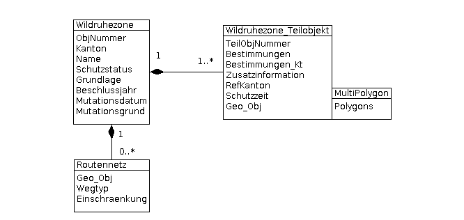
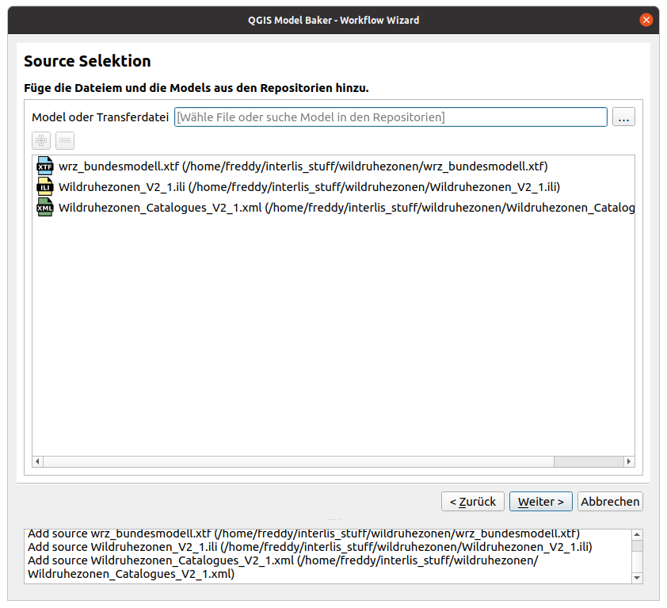
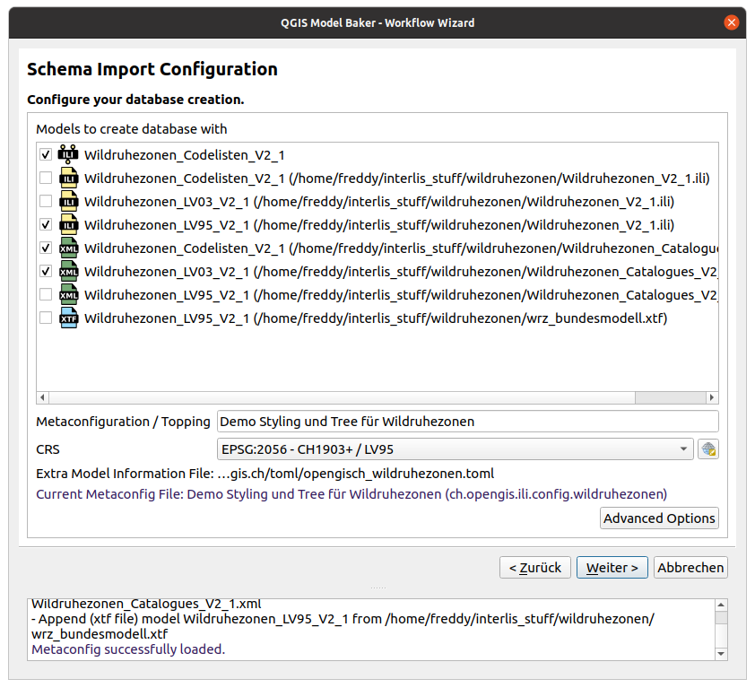
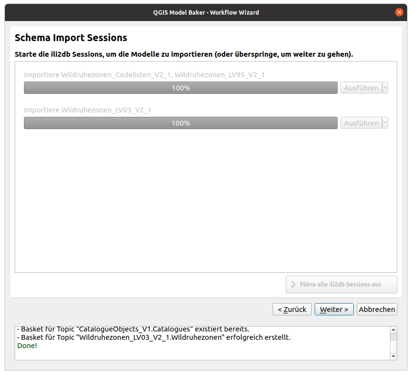
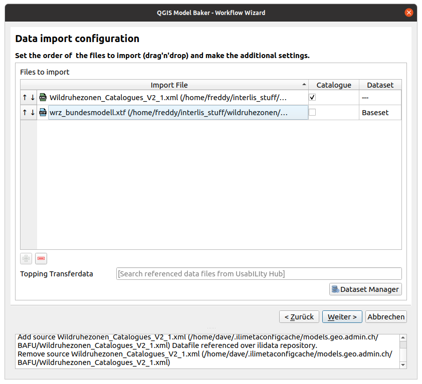
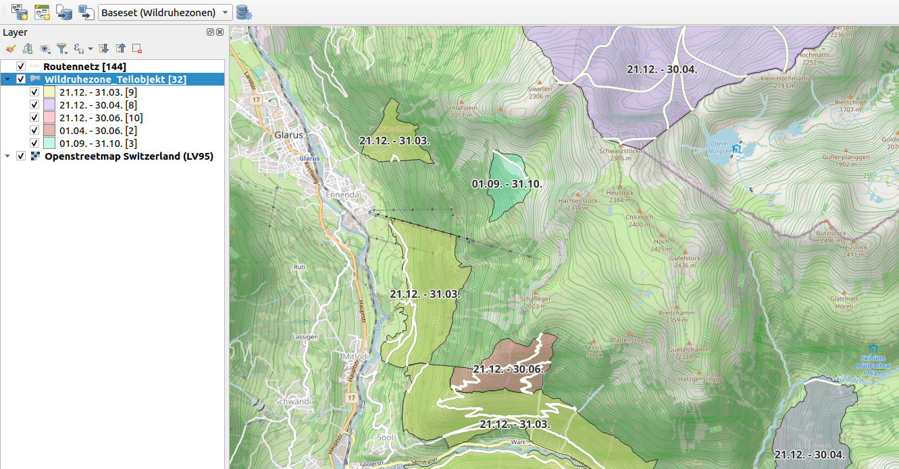

**Nie wars so einfach. Das Erstellen von fixfertig konfigurierten QGIS Projekten aufgrund von INTERLIS Modellen mit dem QGIS Model Baker.**

Den *QGIS Model Baker* gibt's ja schon lange. Vor mehr als vier Jahren kam die Version 1.0.0 heraus - damals noch unter dem Namen *QGIS Project Generator*. Seither ist viel geschehen. Und speziell in diesem Jahr ist viel betreffend Benutzbarkeit gegangen. Der *UsabILIty Hub* wurde integriert, Baskets und Datasets werden unterstützt und dank eines Wizards verliert sich der Benutzer nicht in Konfigurationen und Dialogen.

### Was ist Model Baker?
Der *Model Baker* ist ein QGIS Plugin, mit dem sich ein QGIS Projekt schnell und mit wenigen Mausklicks aus einem physikalischen PostGIS, Geopackage oder MSSQL Datenmodell erstellen lässt. Model Baker analysiert die existierende Struktur konfiguriert ein QGIS Projekt mit allen verfügbaren Informationen. Durch diese Automatisierung kann der Projektkonfigurationsaufwand gesenkt werden. 

Modelle, die in INTERLIS definiert wurden bieten zusätzliche Metainformationen wie Domains, Einheiten von Attributen oder objektorientierte Definitionen von Tabellen. Dies kann genutzt werden um die Projektkonfiguration noch weiter zu optimieren. Der Model Baker verwendet *ili2db* (Link), um ein INTERLIS Modell in eine physikalische Datenbank zu importieren und diese Metainformationen, um den Ebenenbaum, Feldwidgets mit Bedingungen, Formularlayouts, Relationen und vieles mehr automatisch zu konfigurieren.

Ausserdem lässt sich der Model Baker auch als Framework für andere Projekte verwenden. Das Plugin [Asistente LADM-COL](https://github.com/SwissTierrasColombia/Asistente-LADM-COL), das für das [kolumbianische Umsetzung des Land Administration Domain Model (LADM)](https://www.proadmintierra.info/) erstellt wurde, nutzt Model Baker als Library, um möglichst viel der spezifischen Lösung als QGIS Kernfunktionalität umzusetzen.

### Was ist Interlis?
[INTERLIS](https://www.interlis.ch/) ist eine Datenbeschreibungssprache und ein Transferformat mit besonderer Berücksichtigung von Geodaten. INTERLIS bietet die Möglichkeit, räumliche Daten sehr genau zu beschreiben, modellkonform zu integrieren und unter verschiedenen Anwendern einfach auszutauschen. In der Geoinformationsgesetzgebung ist INTERLIS seit 2008 gesetzlich verankert. Da INTERLIS seit Version 2 objektorientiert ist, lässt es sich sehr einfach erweitern. Das bedeuted, dass zBs. der Bund ein Modell definiert, dass die Kantonalen Stellen nach ihren Bedürfnisse ableiten und erweitern können.

#### Beispiel eines Interlis Modelles
Das INTERLIS Bundesmodell `Wildruhezonen_LV95_V2_1` sieht (stark vereinfacht) so aus:
```
MODEL Wildruhezonen_LV95_V2_1 (de)
VERSION "2020-04-21"  =
  IMPORTS GeometryCHLV95_V1,LocalisationCH_V1,CHAdminCodes_V1,Wildruhezonen_Codelisten_V2_1;

  TOPIC Wildruhezonen =
    DEPENDS ON Wildruhezonen_Codelisten_V2_1.Codelisten;

    DOMAIN
      Polygon = SURFACE WITH (STRAIGHTS) VERTEX GeometryCHLV95_V1.Coord2 WITHOUT OVERLAPS > 0.001

    CLASS Wildruhezone =
      ObjNummer : MANDATORY 0 .. 9999;
      Kanton : MANDATORY CHAdminCodes_V1.CHCantonCode;
      Name : MANDATORY TEXT*80;
      Schutzstatus : MANDATORY Wildruhezonen_Codelisten_V2_1.Codelisten.Schutzstatus_CatRef;
      Grundlage : MANDATORY TEXT*250;
      Beschlussjahr : MANDATORY INTERLIS.GregorianYear;
      Mutationsdatum : INTERLIS.XMLDate;
      Mutationsgrund : LocalisationCH_V1.MultilingualMText;
    END Wildruhezone;

    CLASS Routennetz =
      Geo_Obj : MANDATORY Linie;
      Wegtyp : MANDATORY Wildruhezonen_Codelisten_V2_1.Codelisten.Wegtyp_CatRef;
      Einschraenkung : TEXT*254;
    MANDATORY CONSTRAINT NOT (Wegtyp->Reference->Code == "W1") OR NOT (DEFINED (Einschraenkung));
    END Routennetz;

    CLASS Wildruhezone_Teilobjekt =
      TeilObjNummer : MANDATORY TEXT*30;
      Bestimmungen : MANDATORY Wildruhezonen_Codelisten_V2_1.Codelisten.Bestimmungen_CatRef;
      Bestimmungen_Kt : LocalisationCH_V1.MultilingualMText;
      Zusatzinformation : TEXT*500;
      RefKanton : INTERLIS.URI;
      Schutzzeit : MANDATORY TEXT*250;
      Geo_Obj : MANDATORY Polygon;
    MANDATORY CONSTRAINT NOT (Bestimmungen->Reference->Code == "R900" OR Bestimmungen->Reference->Code == "E900") OR DEFINED (Bestimmungen_Kt);
    END Wildruhezone_Teilobjekt;

    ASSOCIATION RoutennetzWildruhezone =
      WRZ_Routennetz -- {0..*} Routennetz;
      WRZ -<#> {1} Wildruhezone;
    END RoutennetzWildruhezone;

    ASSOCIATION Wildruhezone_TeilobjektWildruhezone =
      WRZ_Teilobjekt -- {1..*} Wildruhezone_Teilobjekt;
      WRZ -<#> {1} Wildruhezone;
    END Wildruhezone_TeilobjektWildruhezone;
  END Wildruhezonen;
END Wildruhezonen_LV95_V2_1.
```
Das Original findet ihr [hier](https://models.geo.admin.ch/BAFU/Wildruhezonen_V2_1.ili)
Es ist grunsätzlich "lesbar" aufgebaut - aus Sicht eines Technikers. Ein Blick auf das UML erleichtert das Verständnis.



### Vom INTERLIS Modell zum QGIS Projekt
 Oft bekommen Benutzer einfach ein paar Files mit Endungen `ili` oder `xtf` und sie wissen nicht genau, was damit anzufangen ist. 

Glücklicherweise dürfen wir im Release 6.6 einen brandneuen Wizard vorstellen. Die Idee ist, dass Powerusers die Kontrolle sehr wohl behalten können, man allerdings nicht zwingend wissen muss was man in welcher Reihenfolge geschehen soll. Man wird anstelle automatisch durch den Prozess begleitet. Lasst uns eine Beispiel durchspielen.

## Ablauf
Nehmen wir zum Beispiel Frederick. Frederick hat in seinem CV ein bisschen übertrieben. Eigentlich hat er keine Ahnung von INTERLIS Modellen.
Jetzt hat ihm aber jemand einige Files geschickt, die er sich in QGIS anschauen soll:
- Wildruhezonen_V2_1.ili
- Wildruhezonen_Catalogues_V2_1.xml
- wrz_bundesmodell.xtf

Würde Freddy den Model Baker Wizard öffnen, hätte er verschiedene Optionen zur Auswahl: 
- Daten hinzufügen
- Ein Projekt aufgrund einer bestehenden Datenbank erstellen
- Daten exportieren

Weil Frederick aber keine Ahung hat, was er überhaupt möchte, zieht er die Files einfach ins QGIS rein. Die Files mit der Endung `xtf`,`ili` und `xml` werden vom *Model Baker* erkannt und die Wizard-Seite für das hinzufügen von Datenquellen wird geöffnet.



### Daten hinzufügen
Man kann Datenquellen auf verschiedene Weisen hinzufügen. Entweder man zieht sie wie Frederick ins QGIS oder man geht über die erste Wizard Option "Daten hinzufügen" auf dieselbe Seite. Dort kann man weitere Files mit drag'n'drop reinziehen oder über den File Browser öffnen und mit dem + Button. INTERLIS Modelle kann man aber auch von einem Repository laden. Einfach den Namen oben eintippen.

> **Was ist denn ein Repository?**
> Implementierte INTERLIS Modelle lassen sich automatisch übers Web finden. Dazu dient als Index die Datei ilimodels.xml auf http://models.interlis.ch und die mittels der Datei ilisite.xml verknüpften Repositories. Diese Repositories sind neben dem Bundesrepository auch eine vielzahl an Kantonalen Repositories. Somit stehen uns im Model Baker die Modelle des gesamten Schweizer Geodatenkatalog zur Verfügung, die im INTERLIS Format vorhanden ist.

## Datenbank auswählen

Im nächsten Schritt konfiguriert man die Datenbankverbindung. Frederick wählt seine PostgreSQL Datenbank und ein neues Datenbankschema. Auch GeoPackage oder MSSQL werden unterstützt.

## Umsetzung der Modelle



Schliesslich sieht Frederick eine Auflistung der Modelle, die physikalisch umgesetzt werden. Es werden einerseits die Modelle aus dem von ihm hinzugefügten `ili` File angezeigt, wie auch die Modelle, die aus dem Katalog- oder Transferfile (`xtf` oder `xml`) geparst worden sind und vom Repository geladen werden könnten. Doppelt gefundene Modelle werden angezeigt, allerdings nicht gewählt. Frederick könnte die Auswahl noch abändern, tut er aber nicht. Stattdessen schaut er, was man in den "Erweiterten Optionen" machen kann.

In den "Erweiterten Optionen" lassen sich Parameter für `ili2db` setzen, wie beispielweise die Art, wie Vererbungen umgesetzt werden (smartInheritance) oder ob man zusätzliche Metaattributfiles (`toml`) laden möchte. Auch das lässt Frederick wie vorgeschlagen.

Was er hier noch sieht ist ein Autocompleter, der ihm erlaubt "Toppings" vom UsabILIty Hub zu laden. Er klickt drauf und findet einen Eintrag. Der Eintrag wurde aufgrund des Modells "Wildruhezonen_LV95_V2_1" gefunden und beim anwählen werden Frederick verschiedene Konfigurationen geladen.

> **Was ist der UsabILIty Hub?**
Die Idee des UsabILIty Hub ist es, für Implementierte INTERLIS Modelle Zusatzinformationen automatisch übers Web zu empfangen. So wie wir Modelle durch die Anbindung der Datei ilimodels.xml von http://models.interlis.ch und den verknüpften Repositories erhalten können, können wir die Zusatzinformationen mit der Datei ilidata.xml auf dem UsabILIty Hub (derzeit https://models.opengis.ch) und den verknüpften Repositories erhalten.
> Einstellungens für Tools werden in einer Metakonfigurationsfiles konfiguriert, ebenso wie Links zu Toppingfiles, die Informationen zu GIS Projektes enthalten (wie zBs. Symbologien oder Legendensturkturen). Somit bestehen diese Zusatzinformationen meistens aus einer Metakonfiguration und beliebig vielen Toppings.
> Das `ilidata.xml` wird übrigens auch nach mit den Modellen verknüpften Katalogen durchsucht, und wenn dabei die Modelle, auf welchen die Kataloge basieren, sauber erfasst sind, werden diese Modelle der Liste hinzugefügt.

Danach werden die Modelle mit ili2db physikalisch erstellt. 



Die Datenbankstruktur wurde erfolgreich umgesetzt.

## Daten importieren
Anschliessend werden dir die zu importierenden Transferfiles aufgeführt. Einerseits die von Freddy hereingezogenen Files, aber auch die Kataloge, die über die Repositorien gefunden hätten werden können oder auch im Metakonfigurationsfile vom UsabILIty Hub erfasst gewesen wären. Da Kataloge oftmals in `xml` Files gespeichert wird, werden `xml` Dateien standartmässig als Kataloge gekenntzeichnet und somit ins Dataset der Kataloge importiert. Für das Datenfile könnte Frederick ein neues Dataset über den Dataset Manager erstellen. Ansonsten wird das Standard-Dataset ("Baseset") verwendet.



> **Was sind Datasets?**
> Datasets sind Datensätze eines bestimmten räumlichen oder thematischen Bereichs, die aber die Modellstruktur nicht tangieren. Die Daten eines Datasets können so unabhängig der anderen Daten verwaltet, validiert und exportiert werden. Eine kleinere Instanz sind die Baskets oder Behälter. Währenddem die Datasets meist das ganze Modell (oder sogar mehrere) umfassen, sind die Behälter meist Teil eines Topics. Oftmals sind sie sogar die Teilmenge von Topic und Dataset.

Auch hier erscheint wieder eine Autocomplete Widget mit vermerk "Topping". Es ist so, dass auch wenn keine Metakonfigurationsfiles verfügbar sind, Kataloge über das ilidata.xml auf UsabILIty Hub verlinkt sein könnten. Das sind diese derren Model im vorgängigen Schritt ebenfalls hinzugefügt worden wären und nun zur Auswahl stehen. In Fredericks Fall ist der einzige verlinkte Katalog allerdings schon aus seinen Files verfügbar. Hätte er dieses File nicht hinzugefügt, stünde ihm jetzt die Auswahl zur Verfügung.

Daten werden importiert und stehen in der Datenbank bereit um gebacken zu werden.

## Und schliessliech wird alles gebacken
Im letzten Schritt kommt man zur Kernfunktion des Model Bakers. Der Model Baker lädt die Tabellen der Datenbank in Layers, verknüpft diese mit Relationen, konfiguriert die Widgets und setzt die Bedingungen. Falls er im über den UsabILIty Hub geladenen Metakonfigurationsfile auch noch QML Files für spezifische Layers findet, werden auch diese geladen. Ebenfalls die Legende.

Das Resultat ist ein fixfertiges, ready-to-use QGIS Projekt.



Fredericks Cheffin ist beeindruckt und entlässt ihn noch nicht gleich. Frederick ist froh, war alles so einfach und er beginnt Model Baker und ili2db richtig gern zu benutzen. Auch über INTERLIS informiert er sich tiefgehend. Auch später noch - als QGIS Poweruser und INTERLIS Pro - benutzt er Model Baker mit all seinen Möglichkeiten.

Bon appetit!
