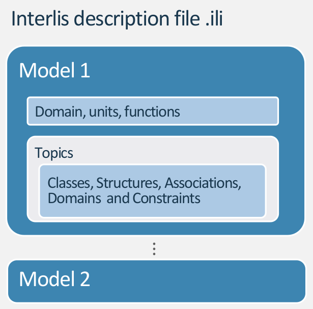
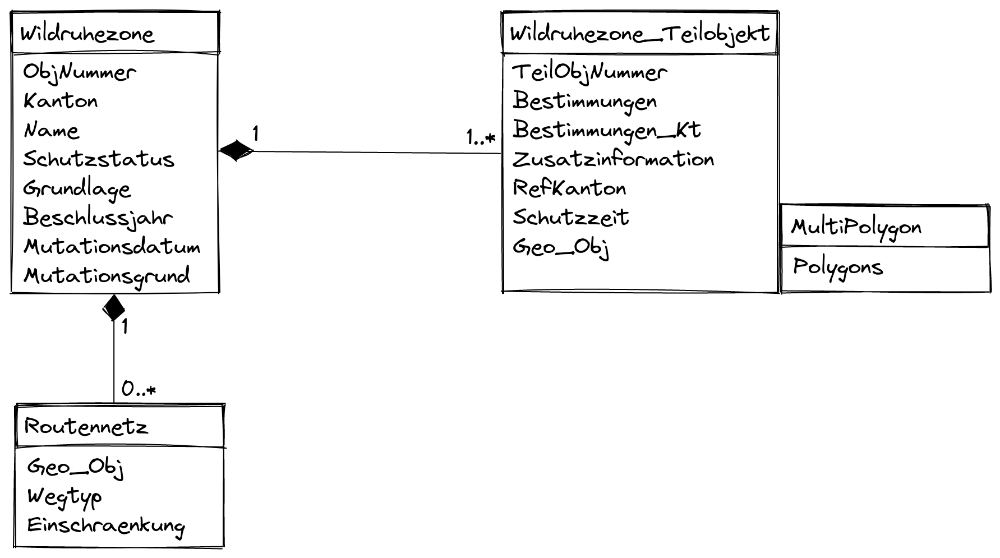

# What is INTERLIS and why it's used

--- 

[INTERLIS](https://www.interlis.ch/) (INTER Land Information Systems) is a data description language and a transfer format with special consideration of geodata. INTERLIS offers the possibility to describe spatial data precisely, to integrate them in conformity with the model and to exchange them easily among different users. INTERLIS has been bindingly anchored in Swiss geoinformation legislation since 2008. Since INTERLIS has been object-oriented since version 2, it can be extended very easily. This means that, for example, the federal government defines a model that the cantonal authorities can derive and extend according to their needs.

--- 

- A very precise standardized language at a conceptual level for the description of
data models (schemas)
- Easy extendable (so optimal for data exchange between authorities with different needs)
- System neutral (platform independent)
- Facilitates communication and understanding between IT and thematic specialists
- It is readable by both humans and machines
- Integrates data types to be used on GIS (for example Geometries)
- Strict division between the transfer part and the modeling part (model driven
approach)

--- 

> Personally I like about INTERLIS that you have your database schema in your poket. It's readable and precice. Compared to e.g. SQL Scripts you can simply extend it. Thanks to the nice tools (ili2 and Model Baker) it's easy to implement in your database and in QGIS.

--- 

# INTERLIS Modelling in 10 Minutes

--- 
## Model Structure
```
INTERLIS 2.3;
MODEL Wildruhezonen_LV95_V2_1 (de)
AT "https://models.geo.admin.ch/BAFU/"
VERSION "2020-04-21"  =
  DOMAIN
    Punkt = GeometryCHLV95_V1.Coord2;
  TOPIC Wildruhezonen =
    CLASS Wildruhezone =
      Name : MANDATORY TEXT*80;
    END Wildruhezone;
  END Wildruhezonen;
END Wildruhezonen_LV95_V2_1.
```



<!-- A model contains Units, Functions, Domains, Classes, Structures and Topic definitions -->

--- 
## Classes

**Syntax**
```
ClassDef =  'CLASS' Class-Name '='
              { AttributeDef }
            'END' Class-Name ';'.
```

**Example**
```   
CLASS Wildruhezone =
  ObjNummer : MANDATORY 0 .. 9999;
  Name : MANDATORY TEXT*80;
END Wildruhezone;
```
<!-- Classes are like templates to create objects (class elements) from. Or entities in the context of databases. They have properties described as attributes. -->

--- 
## Attributes
**Syntax**
```
AttributDef = Attribute-Name : [MANDATORY] 
                               Type | DomainRef;

DomainRef = [ Model-Name '.' [ Topic-Name '.' ] ] Domain-Name
```
**Example**
```
Name : MANDATORY TEXT*80;
Schutzstatus : MANDATORY Wildruhezonen_Codelisten_V2_1.Codelisten.Schutzstatus_CatRef;
```

---
## Structures
**Syntax**
```
StructureDef =  'STRUCTURE' Struct-Name '='
                  { AttributeDef }
                'END' Struct-Name ';'.
```
**Example**
```
STRUCTURE PolygonStructure =
  Polygon: Polygon;
END PolygonStructure;

STRUCTURE MultiPolygon =
  Polygons: BAG {1..*} OF PolygonStructure;
END MultiPolygon;
```
<!-- Formally similar to classes are Structures but factually they are more like types or value ranges. They describe how more complicated properties of objects are constructed. The structure elements, have no identity of their own, but are values of attributes of an object. So they cannot exist without belonging to an object of a class. -->
--- 

## Accociations 
**Syntax**
```
AssociationDef = 'ASSOCIATION' '='
                   { RoleDef }
                 'END' ';'.
RoleDef = Role-Name '--' ClassRef ';'.
```
**Example**
```
ASSOCIATION RoutennetzWildruhezone =
  WRZ_Routennetz -- {0..*} Routennetz;
  WRZ -<#> {1} Wildruhezone;
END RoutennetzWildruhezone;
```

---
## Extends
```
CLASS Wildruhezone =
  ObjNummer : MANDATORY 0 .. 9999;
  Name : MANDATORY TEXT*80;
END Wildruhezone;

CLASS Wildruhezone (EXTENDED) =
    /** Zuordnung der Zielarten Schutzbestimmung zur Wildruhezone */
    Zielart: GL_Wildruhezonen_Codelisten_V1.Codelisten.Zielarten_CatRef;
END Wildruhezone;
```
<!-- Of course to extend classes, topics needs to be extended as well. And with the class attributes can be extended as well. -->

---
## Types of classes
- Concrete
- Abstract
- Final
- Derivate/Extended

```
CLASS Wildruhezone (ABSTRACT)=
END Wildruhezone;
```
<!-- Keywords to enforce or prevent specialization -->

---
## What are catalogue

Catalogues are external codelists that can be used like `Enumerations` but less static.

<!-- You can use the "old" model but update your catalogue. -->

## Structure of a catalogue

Catalogues base on the model `CatalogueObjects_V1` and extend the abstract classes and structures
```
CLASS Bestimmungen_Catalogue
EXTENDS CatalogueObjects_V1.Catalogues.Item =
    Code : MANDATORY TEXT*5;
    Description : MANDATORY LocalisationCH_V1.MultilingualText;
END Bestimmungen_Catalogue;

STRUCTURE Bestimmungen_CatRef
EXTENDS CatalogueObjects_V1.Catalogues.MandatoryCatalogueReference =
    Reference (EXTENDED) : MANDATORY REFERENCE TO (EXTERNAL) Bestimmungen_Catalogue;
END Bestimmungen_CatRef;
```
## Reference to the catalogue
```
CLASS Wildruhezone_Teilobjekt =
  Bestimmungen : MANDATORY Wildruhezonen_Codelisten_V2_1.Codelisten.Bestimmungen_CatRef;
END Wildruhezone_Teilobjekt;
```

---
## The real model `Wildruhezonen_LV95_V2_1`



---
## Have a look at the ILI file
[Wildruhezonen_V2_1](./assets/Wildruhezonen_V2_1.ili)

<!-- Mention IMPORTS -->

---
# INTERLIS implementation workflow and tools
---


(Graphic by landnetwork.ch)

---

# ili2 world
made by Eisenhut Informatik 

---
## Compiler ili2c

The INTERLIS Compiler checks an INTERLIS model if the constructs of the language INTERLIS were applied correctly. It reports syntactic errors in the model with the line number so that they can be corrected by the modeler.

---
## ili2fme and ili2db
ili2pg, ili2gpkg and ili2fgdb are programs that write an INTERLIS transfer file according to an INTERLIS model into a database (PostgrSQL/PostGIS, GeoPackage or ESRI FileGDB) or create such a transfer file from a database.

---
## ilivalidator
The ilivalidator tool checks whether data in the INTERLIS 1 and 2 transfer format (*.itf/*.xtf)  complies with the associated model (*.ili). License terms and further information about the ilivalidator can be found here: 

---
# Swiss geodata repositories

---
## ilimodels.xml
- Based on the model `IliRepository09`
- Contains objects of the class `ModelMetadata` where a model name and a file path is defined
- The files are on the same repository

---

## ilisites.xml

- Based on the model `IliSite09`
- Contains objects of the class `SiteMetadata` where path to other repositories are defined
http://models.interlis.ch/ilisite.xml -> http://models.geo.kgk-cgc.ch/ilisite.xml -> http://models.geo.sh.ch/ilisite.xml

[*Let's have a look*](http://models.interlis.ch/)

---

# INTERLIS is the hard stuff


<!-- I might sound like a nerd, but in fact you can get addicted to it. Sometimes ideas appear to model everything in INTERLIS. It's a common thing when you have to do with people using INTERLIS. In fact I thought about to make this presentation (and an abstract and extended version of it) in INTERLIS. -->

---

# QGIS MODEL BAKER is the gateway drug


---
## A QGIS Project Generator
The Model Baker is a QGIS plugin that allows to quickly create a QGIS project from a physical data model. The Model Baker analyzes the existing structure and configures a QGIS project with all available information. 

---

## A QGIS Project Generator optimized for INTERLIS

Models defined in INTERLIS provide additional meta information like domains, units of attributes or object oriented definitions of tables. This can be used to further optimize the project configuration. 

<!-- Model Baker can use the meta information to configure layer tree, field widgets with conditions, form layouts, relations and much more.-->

---

## An ili2db controll station

It provides the user only the needed settings to pass parameters to the ili2db.


---
## And it's a library
Model Baker can be used as a framework for other projects. The plugin [Asistente LADM-COL](https://github.com/SwissTierrasColombia/Asistente-LADM-COL), created for the [Colombian implementation of the Land Administration Domain Model (LADM)](https://www.proadmintierra.info/), uses the Model Baker as a library to implement as much of the specific solution as possible as QGIS core functionality.

# What is the UsabILIty Hub?
Receive meta data like ***ili2db settings***, ***layer styles*** and ***orders*** etc. automatically over the web. 

## Metaconfiguration and Toppings
Get the additional information with the `ilidata.xml` file on the UsabILIty Hub (currently https://models.opengis.ch) and the linked repositories. 

## Metaconfiguration and Toppings
Settings for tools are configured in a metaconfiguration file, as well as links to topping files that contain information about GIS project (such as symbologies or legend structures). Thus, this additional information usually consists of a metaconfiguration and any number of toppings. 

Bild von usabilityhub.ch 

## Why not using INTERLIS

