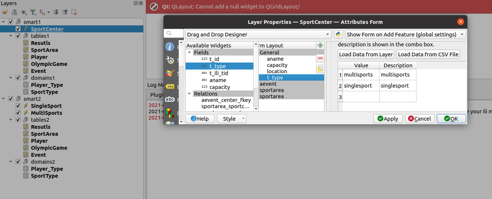
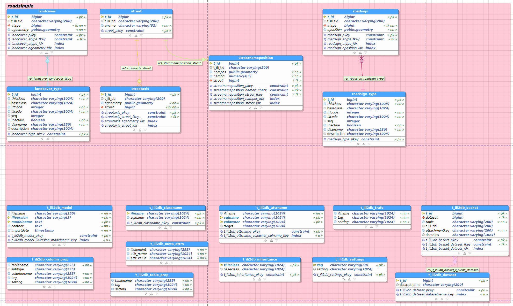
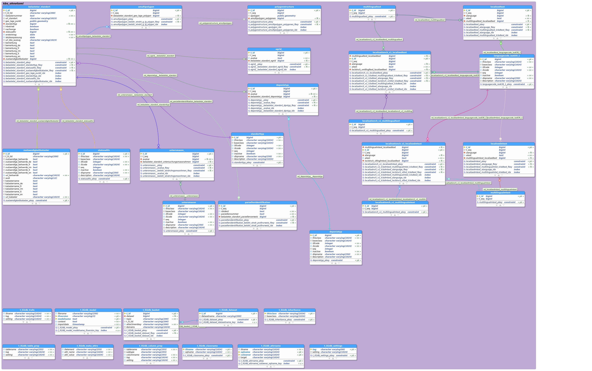

## Links
https://www.interlis.ch/download/interlis2/ili2-refman_2006-04-13_e.pdf

Oder auch Hilfsmittel für die Geodatenmodellierung hier https://www.geo.admin.ch/de/geodatenmodelle/

## Notepad Plugin Interlis
Define own language and import there take [this file](Tools/userDefinedLangNotePad++_interlis.xml)

## INTERLIS MODELLING

The last version of INTERLIS is 2.4, but we use 2.3 since it's the widely supported version.
Differences is mainly the support of coordinate systems on 2.4 and ...

ili-files can have multiple models
```
|- Model 1
   |- Domain, units, functions
   |- Topic
      |- Class
|- Model 2
   |- etc.
```

There are reserved keywords like e.g. "BAG", "ALL"

### IMPORTS
It's possible to IMPORT Model1 to Model2. There we can use the objects (classes, structures etc.) of Model2 like `Model1.TopicOf1.ObjectOf1`.

When we EXTEND an object in Model2 (e.g. `ExtendedObjectOf2`) with `Model1.TopicOf1.ObjectOf1` and we IMPORT Model2 to Model3, we can use the attributes of `Model1.TopicOf1.ObjectOf1` in Model3 with `Model2.ExtendedTopicOf2.ExtendedObjectOf2` without importing Model1. But if the object in Model2 is not extended, then we cannot access the object of Model1 just because it's importet in Model2 and Model2 is importet to Model3.

Wir importiernen Model1 ins Model2 - dort können wir Objekte des Model1 verwenden so Model1.TopicOf1.ObjectOf1. Wenn wir ein Objekt in Model2 nun erweitern (also ExtendedObjectOf2 mit Model1.TopicOf1.ObjectOf1) und dann Model2 in Model3 importieren, dann können wir die Attribute von Model1.TopicOf1.ObjectOf1 in Model3 mit Model2.ExtendetTopicOf2.ExtendedObjectOf2 nutzen ohne Model1 zu Importieren. Allerdings nur die erweiterten Objekte von Model2. Wir können nicht auf Objekte von Model1 zugreiffen, nur weil wir Model2 importieren, welches Model1 importiert hat.

#### IMPORTS with example `Units`
```
INTERLIS 2.3;
MODEL EARTH AT "mailto:david@opengis.ch" VERSION "2021-06-22" =
    IMPORTS Units; !!see Appendix F of INTERLIS-Reference Manual: there we find Atmosphere [atm] = 101325 [Pa];
    DOMAIN
      Atmospheric_Pressure = 00.00 .. 90000.00 [Units.atm];
    TOPIC Water =
    END WATER;
END EARTH;
```
We need to use the short form `[atm]` but if there is no short form in Units Model, then we have to use the full name `Horsepower`.

#### Unqualified IMPORTS
```
INTERLIS 2.3;
MODEL EARTH AT "mailto:david@opengis.ch" VERSION "2021-06-22" =
    IMPORTS UNQUALIFIED Units; !!then we don't need to define prefix Units. because it looks in all the imports
    DOMAIN
      Atmospheric_Pressure = 00.00 .. 90000.00 [atm];
    TOPIC Water =
    END WATER;
END EARTH;
```

### TOPICS
Topics are private. This means we cannot IMPORT parts of the Topics.
```
INTERLIS 2.3;
MODEL UtilityNetwork AT "mailto:david@opengis.ch" VERSION "2021-06-22" =
    IMPORTS Units; !!see Appendix F of INTERLIS-Reference Manual: there we find Atmosphere [atm] = 101325 [Pa];
    DOMAIN
      Atmospheric_Pressure = 00.00 .. 90000.00 [Units.atm];
    TOPIC WaterNetwork =
        CLASS PIPELINE =
        END PIPELINE;
    END WaterNetwork;
END UtilityNetwork;
```
#### Extending Topics
So the attributes of a class can be 
```
    TOPIC LocalWater EXTENDS WaterNetwork =
        CLASS Pipeline (EXTENDED) =
        ...
```

Or like this:
```
  TOPIC Events
  EXTENDS OlimpycGames.Events =
    DEPENDS ON OlimpycGames.Events;
```
So it `EXTENDS` and `DEPENDS`. While the `EXTENDS` is the whole inheritance thing, the `DEPENDS` means it wants to use e.g. types from the OlimpycGames.Events - means `DEPENDS` is like `IMPORT`.

#### Models to Topics
While Models can be imported, Topics can be extended... And Topics can "depend"

### CLASSES
- Concrete - normal (ohne keyword)
- Abstract - cannot have instances
- Final - cannot been extended
- Derivated/Extended (kann concrete oder final sein)

### STRUCTURES
The object in classes should have an identificator - the objects in structure cannot.

In the practise we use structures when we have composite attributes. 
```
STRUCTURE ParcelAddress =
    StreetName: TEXT*40;
    Number: TEXT*12;
END ParcelAddress;
CLASS Parcel = 
    Number: ParcelAddress;
END Parcel;
```

The type (for like e.g. the Number in Parcel) cannot be a class. But the classes can reference sturctures.
And we cannot reference classes in another classes. 

> I think in the transfer files the values of the structure are stored inside the class object.

### BAG OF vs LIST OF
A list has an order.
In case e.g. of defining lines we  have a list of points.

### REFERENCE TO
I think it's mainly to have a class object as an attribute:
```
	TOPIC TopicA =

		CLASS ClassA1 =
		END ClassA1;
		
		STRUCTURE StructA1 =
			attrA10 : REFERENCE TO (EXTERNAL) ClassA1;
		END StructA1;

		CLASS ClassB1 =
			attrA1: StructA1;
		END ClassB1;

	END TopicA;
```
Catalogues are designed like that. In Interlis 2.3 it's not possible to make these REFERENCE TO directly in the class, so it needs to go over this structure.

#### CatalogueReference vs. MandatoryCatalogueReference
Btw. it mostly makes sence to use MandatoryCatalogueReference even when the attribute in the class is not mandatory. Because in the STRUCTURE the Reference should be NOT NULL, otherwise it should not exist. Like:
```
    STRUCTURE MaterialItemRef
    EXTENDS CatalogueObjects_V1.Catalogues.MandatoryCatalogueReference =
      /* Reference is MANDATORY because it extends mandatory Rerference in MandatoryCatalogueReference */
      Reference (EXTENDED) : REFERENCE TO (EXTERNAL) MaterialItem;
    END MaterialItemRef;
```
Except, if in the structure are other attributes as well. Like:
```
    STRUCTURE PersonRef =
      Reference : REFERENCE TO (EXTERNAL) Person;

      AHVN13 : TEXT*40;

      MANDATORY CONSTRAINT DEFINED(Reference) OR DEFINED(AHVN13);

    END PersonRef;

```

### Inheritances
See the example of the Earth Model.

We have `(EXTENDED)` and `EXTENDS`.

#### Inheritances of associations
#### EXTENDS

Inherit from class from same topic:
```
    TOPIC Water =
        CLASS WaterStructure = 
            Address: BAG {1..*} OF Address;
        END WaterStructure;

        CLASS LocalWaterStructure EXTENDS WaterStructure =

        END LocalWaterStructure;
    END Water;
```

Inherit from other topic and use the class from inherited topic for inheritance:
```
    TOPIC Water =
        CLASS WaterStructure = 
            Address: BAG {1..*} OF Address;
        END WaterStructure;
    END Water;

    TOPIC LocalWater EXTENDS Water=
        CLASS LocalWaterStructure EXTENDS WaterStructure =

        END LocalWaterStructure;
    END LocalWater;
```

Inherit from other topic by adding the full path:
```
    TOPIC Water =
        CLASS WaterStructure = 
            Address: BAG {1..*} OF Address;
        END WaterStructure;
    END Water;

    TOPIC LocalWater EXTENDS Water=
        CLASS LocalWaterStructure EXTENDS Earth.Water.WaterStructure = 

        END LocalWaterStructure;

        CLASS LocalWaterStructure1 EXTENDS Earth.Water.WaterStructure = 

        END LocalWaterStructure1;
    END LocalWater;
```

#### EXTENDED
It's kind of an override. See the difference in the example:

```
    TOPIC Water =
        CLASS WaterStructure = 
            Address: BAG {1..*} OF Address;
        END WaterStructure;

        CLASS WaterStructure (EXTENDED) =

        END WaterStructure;
    END Water;
```

We cannot extend a topic:
```
 TOPIC Water =
        CLASS WaterStructure = 
            Address: BAG {1..*} OF Address;
        END WaterStructure;
    END Water;

    TOPIC Water (EXTENDED)=
```
... leads to:`There can not be a TopicDef "Water" in MODEL Earth because there is already a model element with the same name. Use a different name.`

But we can use extended topics and use the classes to extend:
```
    TOPIC Water =
        CLASS WaterStructure = 
            Address: BAG {1..*} OF Address;
        END WaterStructure;
    END Water;

    TOPIC LocalWater EXTENDS Water=
        CLASS WaterStructure (EXTENDED)= 
            Text: TEXT*23;
        END WaterStructure;
    END LocalWater;
```

But be aware with the names. When we do this:

```
    TOPIC Water =
        CLASS WaterStructure = 
            Address: BAG {1..*} OF Address;
        END WaterStructure;
    END Water;

    TOPIC LocalWater EXTENDS Water=
        CLASS WaterStructure (EXTENDED)= 
            Text: TEXT*23;
        END WaterStructure;

        CLASS LocalWaterStructure EXTENDS Earth.Water.WaterStructure = 

        END LocalWaterStructure;
    END LocalWater;
```
We receive this eror:

`CLASS Earth.LocalWater.WaterStructure can not extend CLASS Earth.Water.WaterStructure without changing its name. There must not exist any other extensions of CLASS Earth.Water.WaterStructure in TOPIC Earth.LocalWater. However, CLASS Earth.LocalWater.LocalWaterStructure extends CLASS Earth.Water.WaterStructure.`

I think it's because Earth.Water.WaterStructure has been already overriden. It would work to use the "local" WaterStructure

```
    TOPIC Water =
        CLASS WaterStructure = 
            Address: BAG {1..*} OF Address;
        END WaterStructure;
    END Water;

    TOPIC LocalWater EXTENDS Water=
        CLASS WaterStructure (EXTENDED)= 
            Text: TEXT*23;
        END WaterStructure;

        CLASS LocalWaterStructure EXTENDS WaterStructure = 

        END LocalWaterStructure;
    END LocalWater;
```
#### When EXTENDED when EXTENDS
Ich denke der Unterschied ist, dass man bei EXTENDS ein anderer Name hat als bei EXTENDS.

Peter Staub sagte mal:
> (EXTENDED) ist nur zu verwenden, wenn man zu einer bestehenden Klasse z.B. weitere Attribute hinzufügen will oder insbesondere dann, wenn man bereits definierte Attribute erweitert (z.B. TEXT zu TEXT*25). Die Grundsemantik der erweiterten Klasse bleibt dabei gleich.
> EXTENDS ist dann zu wählen, wenn man die Grundsemantik verändert bzw. erweitert und grundsätzlich neue Eigenschaften modelliert. Insbesondere dann wenn abstrakte Klassen aus einem Basismodell zu mehreren konkreten Klassen mit unterschiedlichen Eigenschaften ausmodelliert werden.

#### Base Model / Extended Model Problematik
Zur Problematik [hier](https://github.com/opengisch/QgisModelBaker/issues/671) meinte er:
> Also, wenn man ein Topic erweitert, dann sind alle Klassen des erweiterten Basismodells sowieso auch verfügbar!
> Man muss sie also nicht explizit mit (EXTENDED) noch «reinziehen».
> Das ist vielleicht eine Fehlkonzeption der Vererbung.

### ASSOCIATION
Noted like this:
```
ASSOCIATION =
    Tree -- {*} Tree;
    Forest -- {0..1} Forest;
END;
```
The first word is the role, then there is the strength and in the end the CLASS. Roles are called usually like the classes, but can be precised. This example here with a recursive relationship - like when a Forest can be part of a bigger forest:
```
ASSOCIATION =
    PartForest -- {*} Forest;
    ParentForest -- {0..1} Forest;
END;
```

#### Strenghts
There are `Association`, `Agrregation` and `Composition` - It's pretty clear what is Association - it's loosy shmoosy noone cares. Trees and bushes can be connected (when e.g. they are grown together) but exist independentaly as well (when you cut off the bush from the tree, the tree is not gone):
```
ASSOCIATION =
    Bush -- {*} Bush;
    Tree -- {0..1} Tree;
END;
```
The Composition is, when the child is part of the parent. Like a foresttree won't exist without a forest. But a forest can still exist without any foresttres (because there are bushes):
```
ASSOCIATION =
    Forest -- <#> {1} Forest;
    ForestTree -- {0..*} ForestTree;
END;
```
The aggregation is something in between. There is needed a forest to have a forest tree, but the forest tree should not be deleted when the forest is gone. I'm not sure. I need to check that case out:
```
ASSOCIATION =
    Forest -- <> {1} Forest;
    ForestTree -- {0..*} ForestTree;
END;
```

What the "Referenzhandbuch" says:
> When dealing with an
**aggregation** all ascribed parts are automatically copied when copying the entity, however when
deleting the entity the corresponding parts **remain untouched**. Compared to an aggregation you will
find that a **composition** further implies, that when deleting the entity **all parts are deleted** at the
same time.

#### Multi-Connection
```
ASSOCIATION =
    Bush -- {*} Bush;
    Tree -- {0..1} Tree;
    Whatever -- {*} Whatever;
END;
```
#### Attributes

```
ASSOCIATION =
    Forest -- <> {1} Forest;
    ForestTree -- {0..*} ForestTree;

ATTRIBUTE
    Percentage: TEXT*32;
END;
```

### Geometries
#### Coordinates
```
Geometry: POLYLINE WITH (STRAIGTS,ARCS)
    VERTEX ZH_Coord;

Surface: SURFACE WITH (STRAIGHTS) VERTEX GeometryCHLV95_V1.Coord2
    WITHOUT OVERLAPS > 0.005;
```

#### Multigeometries
```
      Line = POLYLINE WITH (STRAIGHTS) VERTEX GeometryCHLV95_V1.Coord2;
      Surface = SURFACE WITH (STRAIGHTS) VERTEX GeometryCHLV95_V1.Coord2 WITHOUT OVERLAPS > 0.005;
      
      !! BAG OF with INTERLIS 2.3 only possible with STRUCTURE
      STRUCTURE PointStructure = 
        Point: GeometryCHLV95_V1.Coord2;
      END PointStructure;
      
      !!@ili2db.mapping=MultiPoint
      STRUCTURE MultiPoint =
        Points: BAG {1..*} OF PointStructure;
      END MultiPoint;
      
      STRUCTURE LineStructure = 
        Line: Line;
      END LineStructure;
      
      !!@ili2db.mapping=MultiLine
      STRUCTURE MultiLine =
        Lines: BAG {1..*} OF LineStructure;
      END MultiLine;
      
      STRUCTURE SurfaceStructure = 
        Surface: Surface;
      END SurfaceStructure;
      
      !!@ili2db.mapping=MultiSurface
      STRUCTURE MultiSurface =
        Surfaces: BAG {1..*} OF SurfaceStructure;
      END MultiSurface;
```

#### Class with multiple geometry types

Different Scenarios:
- An object can contain point XOR line XOR poly (see example 1)
- An object can contain point AND/OR line AND/OR poly (see example 2)

##### Example 1
Da ein Fault entweder ein Punkt, oder eine Line oder eine Surface ist, macht es Sinn diese Geometrien direkt zu enthalten.

###### Möglichkeit 1: Mehrere Geometrietypen im Fault

```
    /** GRUNDLEGENDE ATTRIBUTE des Modells Faults
    */
    CLASS Fault =
	  Fault_Name : TEXT;
	  
	  Point : MANDATORY GeometryCHLV95_V1.Coord2;
	  Line : MANDATORY Line;
	  Surface : MANDATORY Surface;
    END Fault; 
```
Siehe letzte 3 Attribute des Faults.

###### Möglichkeit 2: Geometrie-Faults (extended Faults)
```
    CLASS Fault =
	  Fault_Name : TEXT;

    END Fault; 

    CLASS PointFault
    EXTENDS Fault =
      Geometry : MANDATORY GeometryCHLV95_V1.Coord2;
    END PointGeometry;

    CLASS LineFault
    EXTENDS Fault =
      Geometry : MANDATORY Line;
    END LineGeometry;

    CLASS SurfaceGeometry
    EXTENDS Fault =
      Geometry : MANDATORY Surface;
    END SurfaceGeometry; 
```
3 Klassen erweitern die ABSTRACT Klasse Faults.

###### Fazit
Währenddem die erste Möglichkeit simpler ist, ist die zweite Möglichkeit schöner, da nicht 2 von 3 Geometriespalten quasi leer bleiben müssen. Es ist auch ohne zusätzliche Constraints sichergestellt, dass ein Fault nur eine Geometrie enthält. (Ausserdem kann GPKG irgendwie nicht so gut mit Multigeometries https://github.com/opengisch/QgisModelBaker/issues/531)


##### Example 2
Da ein Fault ein Punkt, und/oder eine Line und/oder eine Surface ist funktioniert das mit der Vererbung nicht so leicht.

###### Möglichkeit 1: Mehrere Geometrietypen im Fault

```
    /** GRUNDLEGENDE ATTRIBUTE des Modells Faults
    */
    CLASS Fault =
	  Fault_Name : TEXT;
	  
	  Point : MANDATORY GeometryCHLV95_V1.Coord2;
	  Line : MANDATORY Line;
	  Surface : MANDATORY Surface;
    END Fault; 
```
Siehe letzte 3 Attribute des Faults.

###### Möglichkeit 2: Geometrie-Faults mit ASSOCIATION Faults)
```
    CLASS Fault =
	  Fault_Name : TEXT;

    END Fault; 

    CLASS GeometryOfInterest(ABSTRACT) =
    END GeometryOfInterest;

    CLASS PointGeometry
    EXTENDS GeometryOfInterest =
      Geometry : MANDATORY GeometryCHLV95_V1.Coord2;
    END PointGeometry;

    CLASS LineGeometry
    EXTENDS GeometryOfInterest =
      Geometry : MANDATORY Line;
    END LineGeometry;

    CLASS SurfaceGeometry
    EXTENDS GeometryOfInterest =
      Geometry : MANDATORY Surface;
    END SurfaceGeometry; 
    
    ASSOCIATION Fault_GeometryOfInterest =
      Fault -<#> {1} Fault;
      GeometryOfInterest -- {1} GeometryOfInterest;
    END Fault_GeometryOfInterest;
```
3 Klassen erweitern die ABSTRACT Klasse Faults.

###### Fazit
Währenddem die erste Möglichkeit simpler ist, enthält sie vielleciht manchmal leere Spalten. Ausserdem kann GPKG irgendwie nicht so gut mit Multigeometries https://github.com/opengisch/QgisModelBaker/issues/531 deshalb ist vielleicht 2 nicht so schlecht.
## Inheritances and it's implementations
See Fabian's presentation for that:
- New Class: parent receives type and the change needs to be done on child and parent
- Super Class: all child attributes go to the parent - bad thing is that we cannot consider not null of child attributes
- Sub Class: all parent attributes are in the child (most common) needs type in the child (if inherits from multiple parents) cannot consider not null constraints of the lowest child when it inherits from non abstract classes
- New + Sub Class: Table is created for each child class (even when it's a parent as well (like C))

### `--noSmartMapping`
- New Starategy

### `--smart1Inheritance`
- abstract classes without associeations are mapped using Sub Class
- abstract classes wiht associations and no concrete Super Class use New Class
- Concrete calsses without concrete Super Class use New Class
- Others use Super Class

### `--smart2Inheritance`
- abstract classes mapped using sub class
- all concrete mapped using new and sub class

### Test with smartInheritance 1 and two
```
    CLASS SportCenter (ABSTRACT) =
      Location : OlimpycGames.WGS84Coord;
      Name : TEXT*150;
      Capacity : 0 .. 1000000;
    END SportCenter;

    CLASS MultiSports
    EXTENDS SportCenter =
      Areas : LIST {1..*} OF OlimpycGames.Events.SportArea;
    END MultiSports;

    CLASS SingleSport
    EXTENDS SportCenter =
      Area : MANDATORY OlimpycGames.Events.SportArea;
    END SingleSport;
```



`smart1Inheritance` leads to one big table with a type.
`smart2Inheritance` leads to two tables with the attributes of the parent.

### t_ili2db_trafo
It's described here what strategy is used for which table.

## Repositories
Looking up for Models, but which one is found? When I look for `Units` and there are several files with defined `Units` multiple times?

1. Look up `Units` written in INTERLIS 2.3 and it takes the first one.

Important Models for geometries and coordinates etc. for Switzerland: http://models.geo.admin.ch/CH/

## UML Editor

The one of claude is newer (supports 2.4) but the columbian one supports more functionality with Metaattributes etc.

### Classes
- italic written names means abstract classes

### Cardinalities after import look shitty
To find out what cardinality-description is belowing to what assocciation line, you can left click association line and "show cardinality"

### Questions
- OID BASKET_OID -> siehe 

```
  REFSYSTEM BASKET BCoordSys~CoordSys.CoordsysTopic
    OBJECTS OF GeoEllipsoidal:
      WGS84;
```

## Data Stuff

### ili2db custom attributes

`--t_id_Name <columnName>`

Then <columnName> will become the primary key of a table.

`--createTidCol`
Then `t_ili_tid` is created.

Can we name t_ili_id as well? Are those named t_id only internal.

### Datasets and Baskets
*Why `--import`, `--replace`, `--delete` and `--dataset` requires `--createBasketCol` and not `--createDatasetCol` - what is the `--createDatasetCol` for?*
> Fabian has never seen the use of `--createDatasetCol` 

A Dataset is associated to a Model.
A Basket is associated to a Topic.

Dataset *..1 Basket
Model *..0 Topic

*Can't we use a Basket over multiple Topics?*
>Fabian says: No

But I'm not sure

*Can't we use a Dataset over multiple Models?*
> Fabian says: Yes. In the theory it's possible.

### Constraints

I don't get it with the UNIQUE CONSTRAINTS in scope of the baskets.

There can be made WHERE type=#public etc..

Or;
```
SET CONSTRAINT WHERE type =#public :
    areAreas(ALL, UNDEFINED, >> Geometry);
```

> diese SET CONSTRAINT Funktion ist noch nice. Oft ersetzt sie ellenlange `MANDATORY CONSTRAINT` Verknüpfungen mit `OR` und `AND`. Aber diese sind nicht Möglich in `STRUCTURES` - nur in `CLASS`. Weshalb? Vermutlich weil ein Subset der Daten geprüft werden muss. Und STRUCTURES haben keine Identity.

Constraints können in einer `CLASS`, `STURCTURE` aber auch `ASSOCIATION` sein. Ebenfalls können sie ausserhalb der Elemente sein um übergreifend zu prüfen. Sie müssen allerdings "unterhalb" der verwendeten Elemente sein:

E.g.:
```
    CLASS AssetItem =
    END AssetItem;
    CLASS Contact =
    END Contact;

    /** Ein Asset hat 0..* Autoren
     */
    ASSOCIATION AssetItem_Contact_Author =
      AuthoredAssetItem -- {0..*} AssetItem;
      Author -- {0..*} Contact;
    END AssetItem_Contact_Author;

    /** Ein Asset hat 0..* Auftraggeber und/oder Rechteinhaber
     */
    ASSOCIATION AssetItem_Contact_Initiator =
      InitiatedAssetItem -- {0..*} AssetItem;
      Initiator -- {0..*} Contact;
    END AssetItem_Contact_Initiator;

    /** EinAsset hat 0..* Einlieferer: Wenn nicht angegeben, dann entspricht der Einlieferer dem Autor.
     */
    ASSOCIATION AssetItem_Contact_Supplier =
      SuppliedAssetItem -- {0..*} AssetItem;
      Supplier -- {0..*} Contact;
    END AssetItem_Contact_Supplier;

    /** Ein Contact muss in mindestens einer Beziehung mit dem AssetItem verknüpft sein.
    */
    CONSTRAINTS OF Contact =
      MANDATORY CONSTRAINT DEFINED(\AuthoredAssetItem) OR DEFINED(\InitiatedAssetItem) OR DEFINED(\SuppliedAssetItem);
    END;
```

> Siehe auch die Syntax der Referenzen auf die Rollen mit Backslash.

### Functions
Define the function -> use the function -> implement the function (external tools)

```
CONTRACTED MODEL ...
[...]
    IMPORTS CoordSys,Units;

    FUNCTION MyCustomFunction(@SADASA, #ASDADAS):@BOOLEAN

```
We need to add `CONTRACTED`. And we need to implement the function somewhere else. E.g. in Java.

### Views
Actually the only use that Fabian knows is to add additional constraints.

And he thinks it's only the PROJECTION that is supported and only from 2.4.
```
VIEW MyViewOfB
    PROJECTION OF ExampleModel.ClassB;
    =
        ALL OF ClassB;

        !!@ilivalid.check=warning
        !!@ilivalid.msg="an additional message"
        MANDATORY CONSTRAINT ...;
END VB;
```

### Other nice things

- On Schema Create you can add `--createscript filename` to create an SQL script.

## Catalogues
[Peters Präsi](course/cats/interlis-catalogues.pdf)

Es sieht so aus:
```
TOPIC Catalogues =
    CLASS Cat42 EXTENDS CatalogueObjects_V1.Catalogues.Item =
        TypeName : MANDATORY TEXT;
        TypeCode : TEXT*2;
    END Cat42;

    STRUCTURE Cat42Ref EXTENDS CatalogueObjects_V1.Catalogues.CatalogueReference =
        Reference (EXTENDED) : REFERENCE TO (EXTERNAL) Cat42;
    END Cat42Ref;
END Catalogues;
```
```
TOPIC MyDataTopic =
    DEPENDS ON MyModel.Catalogues;
    CLASS MyClass =
        Type : MANDATORY MyModel.Catalogues.Cat42Ref;
        AnyOtherMeaningfulAttribute : TEXT;
        AndSoOn : TEXT;
    END MyClass;
END MyDataTopic;
```

And Dave's tick to blast everything up. Actually this would lead to the same physical implementations, except there is no entity `Cat42Ref` created:
```
 TOPIC Catalogues =
  
    CLASS Cat42 EXTENDS CatalogueObjects_V1.Catalogues.Item =
      TypeName : MANDATORY TEXT;
      TypeCode : TEXT*2;
    END Cat42;
    
  END Catalogues;
  
  TOPIC MyDataTopic =
  DEPENDS ON MyModel.Catalogues; 
  
    CLASS MyClass =
      AnyOtherMeaningfulAttribute : TEXT;
      AndSoOn : TEXT;
    END MyClass;

    ASSOCIATION MyClass_Cat42 =
        MyClass -- {0..*} MyClass;
        Type (EXTERNAL)-- {1} MyModel.Catalogues.Cat42;
    END MyClass_Cat42;
  
  END MyDataTopic;
```
But that's of course not so nice...

#### What about CatalogueReference?
In Peters Präsi is written:
> While working with ili2pg, and depending
on your model’s inheritance structure, you
do not need to cope with the «reference-
structure-table» cat42ref at all!
The reference to the catalogue is imple-
mented right in cat42.

I asked him in what case it's used, he replied me:
> Ich glaube, damit diese Katalog-Struktur-Referenz-Geschichte «schön» und «einfach» umgesetzt wird, ist bei der Schemakonfiguration bzw. dem Schemaimport die Kommandozeilenoption --coalesceCatalogueRef nötig.

> Siehe ili2db-Dokumentation, entsprechender Abschnitt:
>   --coalesceCatalogueRef
>   Strukturattribute deren maximale Kardinalität 1 ist, deren Basistyp CHBase:CatalogueReference oder CHBase:MandatoryCatalogueReference ist und die ausser „Reference“ keine weiteren Attribute haben, werden direkt mit einem Fremdschlüssel auf die Ziel-Tabelle (die die konkrete CHBase:Item Klasse realisiert) abgebildet, d.h. kein Record in der Tabelle für die Struktur mit dem „Reference“ Attribut.
> Wenn man das nicht so macht, dann wird vermutlich für die Struktur eine Tabelle angelegt und man muss sich halt über zwei Fremdschlüssel von der Anwendungsklasse zur Referenzierungsstruktur und schliesslich zur Katalog-Tabelle hangeln.

But without the parameter it was still unused in my tests. Anyway, what I found out is, that if there are attributes in `CatalogueRef`:
```
    CLASS MaterialItem EXTENDS CatalogueObjects_V1.Catalogues.Item =
      Name : MANDATORY TEXT;
      Description : TEXT;
    END MaterialItem;
    
    STRUCTURE Material EXTENDS CatalogueObjects_V1.Catalogues.CatalogueReference =
      Reference (EXTENDED) : REFERENCE TO (EXTERNAL) PurposeItem;
      Percentage : TEXT;
    END Material;
```
There would be created a many-to-many relationship (as expected). Maybe that's the use case.

- Model documentation: http://models.geo.gl.ch/pdf/GL_Forstreviere_V1.pdf
- Data model: http://models.geo.gl.ch/ili/GL_Forstreviere_V1.ili
- Catalogue: http://models.geo.gl.ch/xml/GL_Forstreviere_V1_Kataloge.xml

#### What about constraints on Catalogue values

I asked:

Ein Kunde hat seine Enumerations durch Kataloge ersetzt. Nun fragt er, ob seine Bedingung zum Constraint noch gewährleiset werden können. 

Pseudocode als Beispiel mit Enums:
```
​MANDATORY CONSTRAINT
        Material <> #holz OR DEFINED (MetallAnteilInProzent);
```
Er könnte hier vielleicht die stabile Id prüfen, allerdings scheint mir das sehr unschön eine Id im Modell zu haben.
```
MANDATORY CONSTRAINT
        Material <> #550e8400-e29b-11d4-a716-446655440000 OR DEFINED (MetallAnteilInProzent);
```

And Peter replied:

Das geht schon, via Referenzpfad:
```
CLASS MyCatalogue EXTENDS CatalogueObjects_V1.Catalogues.Item =

  MyType: MANDATORY TEXT;

END MyCatalogue;

STRUCTURE MyCatRef EXTENDS CatalogueObjects_V1.Catalogues.CatalogueReference =
  Reference (EXTENDED): REFERENCE TO (EXTERNAL) MyCatalogue;
END MyCatRef;
 
CLASS MyClass =
  WhatTypeIsIt: MANDATORY MyCatRef;
MANDATORY CONSTRAINT
  WhatTypeIsIt->Reference->MyType==”FooBar”;
END MyClass;
```

In den XML-Katalogdaten muss dann ein Objekt mit Wert «FooBar» für das Attribut MyType erfasst sein, damit die Konsistenzbedingung eingehalten werden kann.

Hier ist ein Monster-Datenmodell, welches diesem Meccano exzessiv einsetzt: http://models.geo.admin.ch/Swisstopo/DM_Geology_V2_1.ili (am besten einfach im Dokument nach «->» suchen.

##### MultilingualText

Hierbei muss man schauen, dass man MultilingualText nicht auf den text prüft, sondern im CatalogueItem einen "stabilen" code hat:
```
    CLASS AssetKindItem
    EXTENDS CatalogueObjectTrees_V1.Catalogues.Item =
      Code : MANDATORY TEXT;
      Name : MANDATORY LocalisationCH_V1.MultilingualText;
      Description : LocalisationCH_V1.MultilingualMText;
    END AssetKindItem;
```
Dies würde nicht gehen, weil es ja verschieden Möglichkeiten (je Sprache) gibt:
```
      SET CONSTRAINT WHERE Format->Reference->Name->MultilingualMText->Text == "zip": 
        DEFINED (FormatComposition);
```

Deshalb brauchts den `Code`:
```
      SET CONSTRAINT WHERE Format->Reference->Code == "zip": 
        DEFINED (FormatComposition);
```
### Catalogue Tree Items referenzieren auf einander Gegenseitig
Im Catalogue haben wir mehrere Klassen, die das TreeItem ableiten:
```
    /** Codelist für das Attribut Asset.Kind = Type des Assets (Bericht, Bohrprofil, ...)
    */
	CLASS AssetKindItem
    EXTENDS CatalogueObjectTrees_V1.Catalogues.Item =
      Name : MANDATORY LocalisationCH_V1.MultilingualText;
      Description : LocalisationCH_V1.MultilingualMText;
    END AssetKindItem;

    STRUCTURE AssetKindRef
    EXTENDS CatalogueObjectTrees_V1.Catalogues.CatalogueReference =
      Reference (EXTENDED) : REFERENCE TO (EXTERNAL) AssetKindItem;
    END AssetKindRef;


	/** Codelist für das Attribut Asset.ManCatLabel = Manuell vergebene Themen-Kategorie (Hydrogeologie, Geophysik, ...). Ersetzt die Attribute Topic und Purpose
    */
	CLASS ManCatLabelItem
    EXTENDS CatalogueObjectTrees_V1.Catalogues.Item =
      Name : MANDATORY LocalisationCH_V1.MultilingualText;
      Description : LocalisationCH_V1.MultilingualText;
    END ManCatLabelItem;

    STRUCTURE ManCatLabelRef
    EXTENDS CatalogueObjectTrees_V1.Catalogues.CatalogueReference =
      Reference (EXTENDED) : REFERENCE TO (EXTERNAL) ManCatLabelItem;
    END ManCatLabelRef;
```

Verwundert stellten wir fest, dass im mit Model Baker generierten QGIS Projekt `AssetKindItem` nicht nur auf sich selbst referenziert (als Parent) sondern auch auf `ManCatLabeltem` und sämtliche andere Items, die vom  `CatalogueObjectTrees_V1.Catalogues.Item` ableiten. Für jede referenzierte Klasse wurde ein parent FK erstellt. Dies lässt sich auch reproduzieren mit einem kurzen Demo-Modell:
```
MODEL DMGeolAssets_MultirecursionDemo (en) AT "mailto:localhost" VERSION "2021-07-20" =

  TOPIC RecursionDemo =
    OID AS INTERLIS.UUIDOID;

    CLASS AbstractItem (ABSTRACT) = 
      Name:  TEXT;
    END AbstractItem;

    ASSOCIATION Recursion =
      Parent -<#> AbstractItem;
      Child -- AbstractItem;
    END Recursion;

    CLASS Derived1Item EXTENDS AbstractItem = 
      Decription:  TEXT;
    END Derived1Item;
    CLASS Derived2Item EXTENDS AbstractItem = 
      Issue:  TEXT;
    END Derived2Item;
    CLASS Derived3Item EXTENDS AbstractItem = 
      Something:  TEXT;
    END Derived3Item;
  END RecursionDemo;
END DMGeolAssets_MultirecursionDemo.
```

Derived1Item Tabelle enthält 3 parent FKs: `parent_derived1item`, `parent_derived2item` und `parent_derivd3item`.

> Übrigens sprechen wir hier von der Umsetzung mit Smart2Inheritance -> diese benutzt die Sub-Class Strategie, was bedeutet, dass wir drei Tabellen haben mit den Werten des Parents (`Name`) in jeder Tabelle. Dem steht die Smart1Inheritance gegenüber, welche die Super-Class Strategie benutzt. Diese würde nur eine Tabelle erstellen (`AbstractItem`) mit allen Attributen der Children. Zusätzlich hätte es ein FK auf sich selbst und ein Attribut `t_type` wo man anwählen kann um welche Ableitung es sich handelt. Dies wär aber mühsamer anzuwenden, weil bei der Auswahl des Parents nicht klar ist, um welchen Typ es sich handelt (bzw. wär es fehleranfälliger).

Wenn eine Ableitung umgsetzt wird wird eine neue Tabelle erstellt, die alle Attribute (und Referenzen) der Parent Klasse erbt. Eine Referenz wird also dann pro Ableitung erstellt. In unserem Fall hat die Parent Klasse eine "abstrakte" Referenz zu sich selbst. Das heisst jede Ableitung hat eine Referenz auf sich selbst. 

Und dies wird offenbar - absichtlich oder nicht - so physikalisch umgesetzt, dass die abgeleiteten Klassen Refernzen auf alle anderen Ableitungen enthalten. Dies ist verwirrlich, aber ich denke wir können damit Leben.

### Data can only be exported with Tree Catalogue Data

See https://github.com/opengisch/QgisModelBaker/issues/629
## Constraint Regexp oder Patterns

E.g. In der Klasse Contact sollen e-mail adressen und Websites und tel.Nr. abgebildet werden. Diese sollten einer bestimmten Struktur entsprechen, z.B.: [Ziffern]. [Ziffern]@[Ziffern]. [Ziffern]

Das geht nicht. In PG wärs möglich so:
```
CREATE TABLE emails ( 
  email varchar CONSTRAINT proper_email CHECK (email ~* '^[A-Za-z0-9._%-]+@[A-Za-z0-9.-]+[.][A-Za-z]+$')
 );
```
Man könnte also ein POST Script ausführen. Oder ein Metaattribut für Model Baker implementieren:
```
!!@contraintExpression="'regexp_match( "email",'mailto:^[A-Za-z0-9._%-]+@[A-Za-z0-9.-]+[.][A-Za-z]+$)')"
```
## Stable IDs
We all know that when we define `OID AS INTERLIS.UUIDOID;` we are save to have stable IDs.

Die OID auf dem TOPIC spezifiziert, bedeutet, dass dieser Typ als OID für alle Klassen angewendet wird. Wenn es nur in einer Klasse spezifiziert wird, wird es nur für diese Klasse angwendet.

Bei einer physikalischen Umsetzung wird dann meistens diese ID mit einem generierten Wert abgefüllt bei der Erstellung eines Eintrages. 
Zbs. PostgreSQL: 
```
t_ili_tid uuid DEFAULT uuid_generate_v4()
```
Im Geopackage kann es aber nicht im Backend abgefüllt werden, deshalb erstellt der Model Baker im Projekt einen Default Wert:
```
substr(uuid(), 2, 36)
```

## `BASKET OID` or not

Siehe https://opengisch.github.io/QgisModelBaker/background_info/basket_handling/#basket-oid-or-not

## Physikalische Umsetzung
### KbS_LV94_V1_4 mit TOML


### KbS_LV94_V1_4 ohne TOML


## Daves Import/Export Confusion
Wenn ich ein Modell ohne OID Parameter erstelle und Daten erfasse, werden jedes mal beim Export die `t_id` als `TID` im XML Element verwendet. Beim Import dann, werden die `TID` des XML Elementes als `t_ili_tid` verwendet, die `t_id` werden DB-Intern neu gesetzt. Beim erneuten Export werden dann wieder die `t_id` als `TID` genommen (anstatt den `t_ili_tid`). Weshalb? Muss ich abklären. Evtl. braucht es den OID Parameter, sonst wird immmer `t_id` genommen - aber nicht sicher.

## Extended Classes and Topics
See [here](baskets_with_extended_classes.md)

## What I need to know
- Geometry Types / "Libraries"
- Meta Attributes (ili2db integration)
- Constraints
