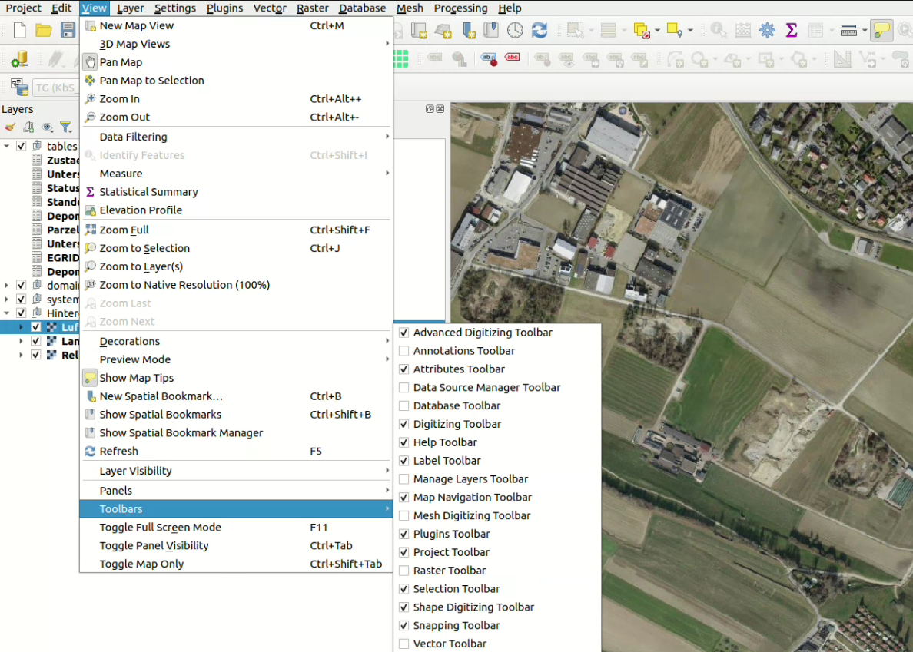
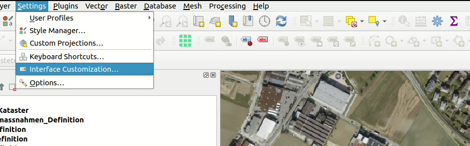
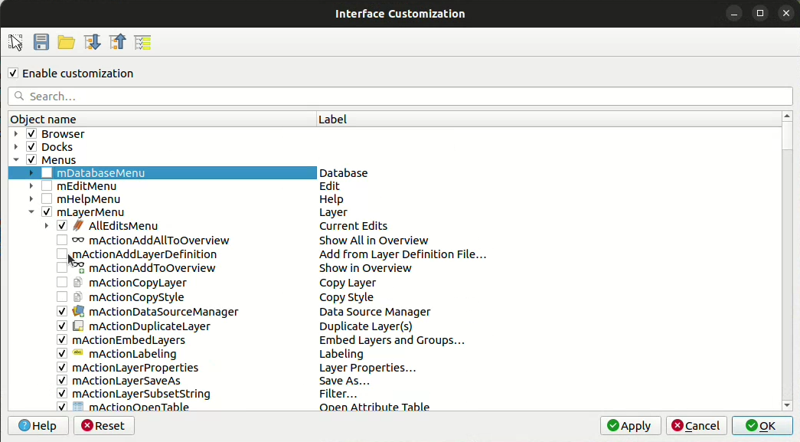
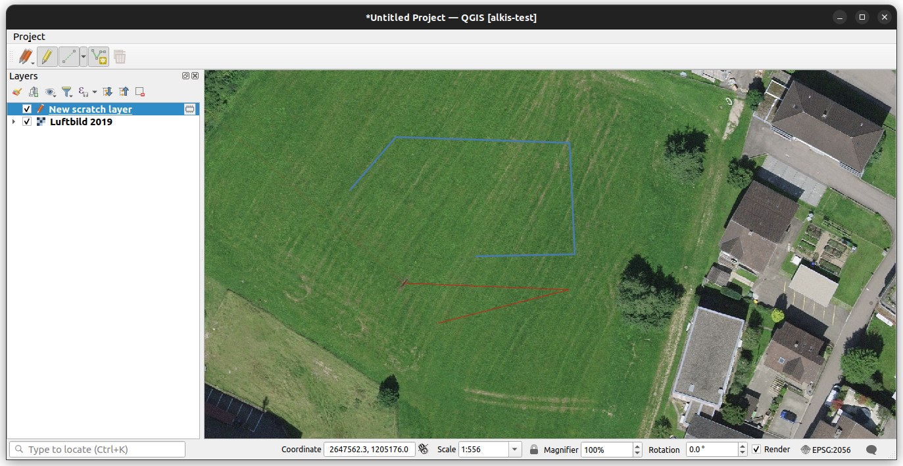

# Anforderungen

## Es geht um

- Visualisierung / Bearbeitung
- Validierung
- Datenaustausch
- Kommunikation mit Messgerät
- Druck + Karte (Atlas Export)

## Probleme / Ansätze

- Man möchte sich nicht abhängig machen vom Monopolisten VertiGIS und ESRI steckt drin.
  
  GIS Dienstleister haben Anbieter nicht im Vertrag.
  
  Kaufweg steht nicht zur Debatte.
- QGIS wie es ist, ist zu mächtig
- Mit Plugin alles verstecken (möchte man eigentlich nicht)...
- ... vs. QGIS Komponenten mit eigener Oberfläche
- Abhängigkeit wenn man QGIS Komponenten nutzt / Vorgehen mit QGIS Versionen

## Status

- LDBV hat Prototypmässig Plugins entwickelt für QGIS ➝ bisschen Erfahrung gesammeln
- LDBV Python und Qt Entwicklung und Prototyp gebaut um Daten zu sammeln - wenn man so ein Weg geht muss man alles nochmals entwickeln.
- Gibt es nicht Dinge, die man aus QGIS rausnehmen kann (zBs. den Canvas)?

## Fragen

- Gerne hätte man einen Einblick welche Komponenten von QGIS verwendbar sind?
  - Interne Architektur auschecken
  - Was ist verwendbar
- Python vs. C++
- Gibt es vergleichbare Projekte?
- Primitive Datei / Datenhaltung - was wird empfohlen
- Ist das ganze überhaupt mit QGIS umsetzbar

## Generelle Info von OPENGIS.ch

- Kreisbögen werden nur beschränkt von QGIS / GEOS unterstützt
  - GEOS ist mal ein Step geschafft (dass es Kreisbögen "kennt")
  - Für Kreisbögen in GEOS wirklich zu unterstützen, bräuchte man 125k - ist also ein grösseres Ding.
  - Crowdfunding aber am Laufen.
- Lösung für die AV basierend auf QGIS (in der Schweiz) als Gesamtprojekt
  - Im Zusammenhang mit Kreisbögen, aber auch generell sollte ein Toolset für Amtliche Vermessung gebaut werden.
  - ZBs. für Geometer der Romandie: Dort wollen sie zBs. ein Treppengenerator / Polarprojektion und anders. Sind diese Andforderungen ähnlich?
  - Wär natürlich schade, wenn in QGIS Sachen gebaut werden, die dann KaTer 2 nicht nutzen kann
- KART zum Austausch der Daten
- QFieldCloud zum Austausch der Daten

# Ansätze

## QGIS Architektur

### Aufbau

- core (Canvas, Legende, Symbole, Models und Items, Providers, Geometrieklassen, QgsApplication (!=QgisApp, was die Objektindentifikation der App ist)
- gui (Formulare, Widgets, Fields, Properties-Dialog aber auch Maptools, QgsInterface) - quasi einzelne Komponenten und auch virtuelle Klassen
- app (die App, das Desktop Programm, die Menus, QgsAppInterface) iface (QgsInterface enthält virtelle classes, werden abgeleitet in QgsAppInterface. zBs. addToolBar kommuniziert dann mit QgsAppInterface in - den Plugins. Aber man könnte QgsInterface natürlich auch ableiten)
- analysis
- server
- 3d

### Library
#### Verfügbar
- core - The CORE library contains all basic GIS functionality
- gui - The GUI library is build on top of the CORE library and adds reusable GUI widgets
- analysis - The ANALYSIS library is built on top of CORE library and provides high level tools for carrying out spatial analysis on vector and raster data
- server - The SERVER library is built on top of the CORE library and adds map server components to QGIS
- 3D - The 3D library is build on top of the CORE library and Qt 3D framework

<https://api.qgis.org/api/index.html>
<https://api.qgis.org/api/3.34/>

#### Nicht Verfügbar
- app - die QGIS Desktop Applikation

> Was ins gui und was in die app kommt ist jeweils Ermessenssache.

## Ansatz Pluginlösung

### QGIS Abspecken

#### Panels und Toolbars zu verstecken

#### Möglichkeiten mit Interface Customization

### Deployen mit QGIS Deployement Toolbelt

Möglich mit <https://guts.github.io/qgis-deployment-cli/index.html>

Siehe: https://www.youtube.com/embed/DgdfAf1GRa0

### Was ist mit Plugins möglich / nicht möglich

- Tools / Formulare / Buttons, die Prozesse ansteuern
- Rechtsklick bleibt Rechtsklick / QGIS App bleibt halt QGIS App
- Ableiten bestehender Objekte nicht immer möglich
- Was waren ihre Limiten, dass sie davon abgekommen sind?

## Ansatz standalone Lösung

> Qt ist das Frameworks - da kombiniert man besser nicht Tk und Qt

### C++

- alles Nutzbar aus core / gui / analyzes / etc.
- Beispiele sind zBs. KADAS
  - [KADAS](https://www.swisstopo.admin.ch/de/kartendarstellungssystem-der-armee)

### Python

- In der Python API ist grundsätzlich ziemlich alles was interessant ist exposed
  - Beispiele sind zBs.
    ➝ check mal Python Standalone Stuff ➝ vielleicht auch Beispiel
- hat noch zBs. processing - wird aber mehr als Console Tool verwendet um processing Algorithmen im Core anzusteuern

### QGIS Quick

- Ansteuerung mit QML
- Auf Mobile Apps ausgerichtet
- Relativ Limitiert
- Beispiele sind zBs. QField

## Abhängigkeiten QGIS

- Wechsel auf Qt 6
- Wechsel auf QGIS 4
- Wenn noch nichts produktiv geht vor 2026, dann lieber mit Qt 6 version arbeiten (dann ist man save nächste 7 Jahre diesbezüglich)...
- ... und keine deprecated Sachen nutzen...
- Dann ist man aber flexibel

## Open Source Karma

- natürlich cool wenn man QGIS nutzt...
- ... und noch cooler wenn man QGIS weiterbringt damit (auch an QGIS Entwicklungen macht/finanziert)

## Datenhaltung lokal

- Vermutlich GeoPackage vorstellen - ist einfach das Naheliegenste - wie der Austausch sein soll dann die Frage. Natürlich kann man GeoPackages nicht vergleichen etc... ...ausser mit Kart... ...oder QFieldCloud...

