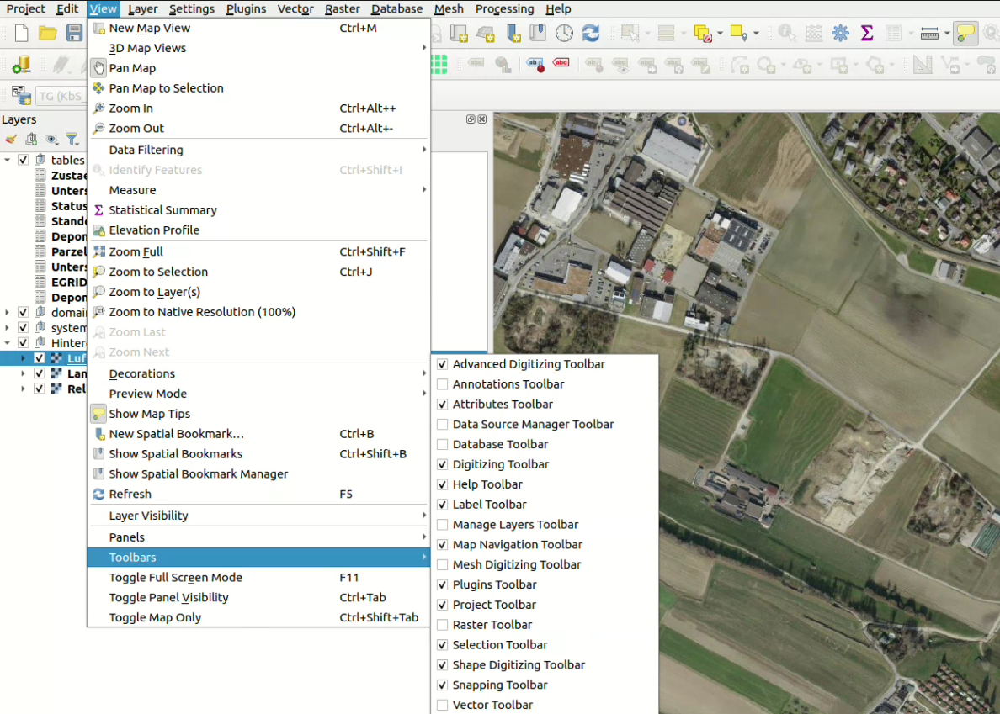
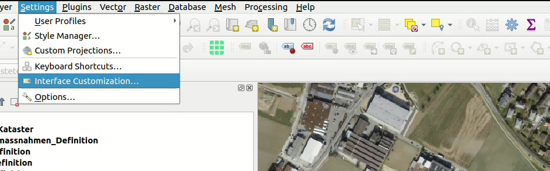
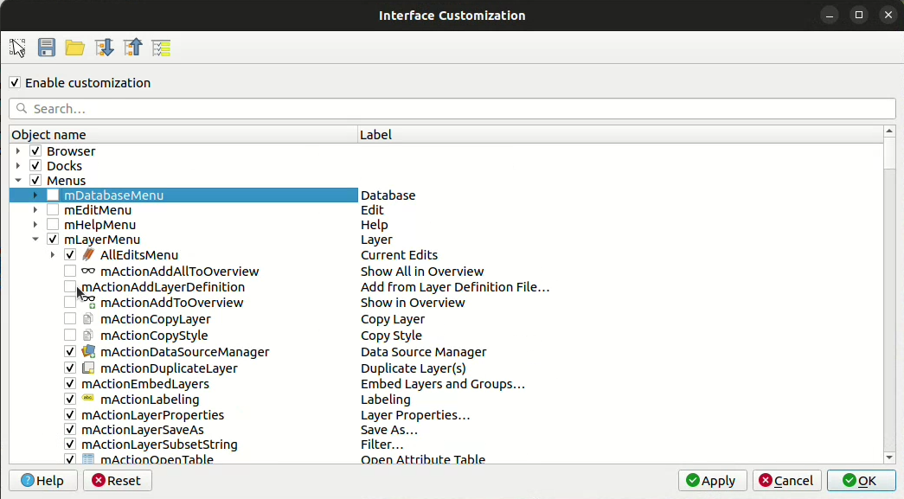
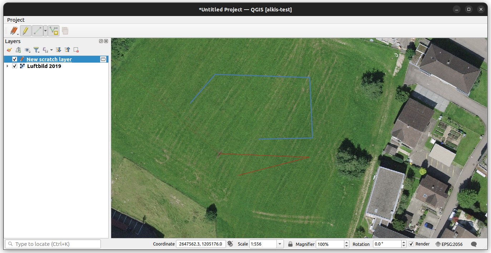

# Workshop  München LDBV

## 18. November 2024

---

# Aktuelle Situation

---

## Beim KaTer Client geht es um

- Visualisierung / Bearbeitung
- Validierung
- Datenaustausch
- Kommunikation mit Messgerät
- Druck + Karte

---

## Probleme / Ansätze

- Man möchte sich nicht abhängig machen vom Monopolisten VertiGIS und ESRI steckt drin.
  
  GIS Dienstleister haben Anbieter nicht im Vertrag.
  
  Kaufweg steht nicht zur Debatte.
- QGIS wie es ist, ist zu mächtig
- Mit Plugin alles verstecken (möchte man eigentlich nicht)...
- ... vs. QGIS Komponenten mit eigener Oberfläche
- Abhängigkeit wenn man QGIS Komponenten nutzt / Vorgehen mit QGIS Versionen

---

## Status

- LDBV hat Prototypmässig Plugins entwickelt für QGIS ➝ bisschen Erfahrung gesammeln
- LDBV Python und Qt Entwicklung und Prototyp gebaut um Daten zu sammeln - wenn man so ein Weg geht muss man alles nochmals entwickeln.
- Gibt es nicht Dinge, die man aus QGIS rausnehmen kann (zBs. den Canvas)?

---

## Anforderungen an den WS

- Gerne hätte man einen Einblick welche Komponenten von QGIS verwendbar sind?
  - Interne Architektur auschecken
  - Was ist verwendbar
- Python vs. C++
- Gibt es vergleichbare Projekte?
- Ist Kater überhaupt mit QGIS umsetzbar?
- Primitive Datei / Datenhaltung - was wird empfohlen
- weiteres?

---

## Mal vorneweg

... ein paar generelle Info, die mir in den Vorbereitungen eingefallen sind

---

### Kreisbögen

- ... werden nur beschränkt von QGIS / GEOS unterstützt
  - GEOS ist mal ein Step geschafft (dass es Kreisbögen "kennt")
  - Für Kreisbögen in GEOS wirklich zu unterstützen, bräuchte man 125k - ist also ein grösseres Ding.
  - Crowdfunding aber am Laufen.

---

### AV Lösungen in der "Pipeline"

- Lösung für die AV basierend auf QGIS (in der Schweiz) als Gesamtprojekt
  - Im Zusammenhang mit Kreisbögen, aber auch generell sollte ein Toolset für Amtliche Vermessung gebaut werden.
  - ZBs. für Geometer der Romandie: Dort wollen sie zBs. ein Treppengenerator / Polarprojektion und anders. Sind diese Andforderungen ähnlich?
  - Wär natürlich schade, wenn in QGIS Sachen gebaut werden, die dann KaTer 2 nicht nutzen kann

---

## Programm

- QGIS Architektur
- Ansatz Pluginlösung
- Ansatz Standalone Lösung
- Abhängikeiten QGIS
- Datenhaltung / Austausch
- Druck

---

## QGIS Architektur

---

### Aufbau

- **core** (Canvas, Legende, Symbole, Models und Items, Providers, Geometrieklassen, QgsApplication (!=QgisApp, was die Objektindentifikation der App ist)
- **gui** (Formulare, Widgets, Fields, Properties-Dialog aber auch Maptools, QgsInterface) - quasi einzelne Komponenten und auch virtuelle Klassen
- **app** (die App, das Desktop Programm, die Menus, QgsAppInterface) iface (QgsInterface enthält virtelle classes, werden abgeleitet in QgsAppInterface. zBs. addToolBar kommuniziert dann mit QgsAppInterface in - den Plugins. Aber man könnte QgsInterface natürlich auch ableiten)

---

- **analysis**
- **server**
- **3d**

---

#### Blick in den Sourcecode

---

### Library

---

#### Verfügbar

- **core** - The CORE library contains all basic GIS functionality
- **gui** - The GUI library is build on top of the CORE library and adds reusable GUI widgets
- **analysis** - The ANALYSIS library is built on top of CORE library and provides high level tools for carrying out spatial analysis on vector and raster data

---

- **server** - The SERVER library is built on top of the CORE library and adds map server components to QGIS
- **3D** - The 3D library is build on top of the CORE library and Qt 3D framework

---

#### Nicht Verfügbar
- **app** - die QGIS Desktop Applikation

> Doch was ins gui und was in die app kommt ist jeweils Ermessenssache.

---

#### Blick in die Doku

https://api.qgis.org/api/index.html

https://api.qgis.org/api/3.34/

---

## Ansatz Pluginlösung

---

### QGIS Abspecken

---

#### Panels und Toolbars zu verstecken

---

#### Möglichkeiten mit Interface Customization

---

---

---

---

### Deployen mit QGIS Deployement Toolbelt

Möglich mit <https://guts.github.io/qgis-deployment-cli/index.html>

Siehe: https://www.youtube.com/embed/DgdfAf1GRa0

---

### Was ist mit Plugins möglich

- Map Tools
- Formulare / Layerstrukturen / Symbologien
- Buttons...
- ...die Prozesse ansteuern

---

### Was ist mit Plugins nicht möglich

- Rechtsklick bleibt Rechtsklick
- QGIS App bleibt halt QGIS App
- Ableiten bestehender Objekte ist nicht immer möglich

---

### Frage

- Was waren ihre Limiten, dass ihr davon abgekommen seid?

---

## Ansatz standalone Lösung

---

### Qt

Qt ist das Frameworks - da kombiniert man besser nicht Tk und Qt

---

### C++

- alles Nutzbar aus core / gui / analyzes / etc.
- Beispiele sind zBs. KADAS
  - [KADAS](https://www.swisstopo.admin.ch/de/kartendarstellungssystem-der-armee)
  - GitHub https://github.com/kadas-albireo/kadas-albireo2?tab=readme-ov-file

---

### Python

- In der Python API ist grundsätzlich ziemlich alles was interessant ist exposed
  - Beispiele;
    - Einfaches Demo Ding https://github.com/whatnick/demo_qgis_app?tab=readme-ov-file

---

#### Ausserdem

- hat noch zBs. processing - wird aber mehr als Console Tool verwendet um processing Algorithmen im Core anzusteuern https://training.gismentors.eu/qgis-plugins/python/processing.html

---

### QGIS Quick

- Ansteuerung mit QML
- Auf Mobile Apps ausgerichtet
- Relativ Limitiert
- Beispiele sind zBs. QField

---

## Abhängigkeiten QGIS

---

### Voraussicht

- Wechsel auf Qt 6
- Wechsel auf QGIS 4

---

### Empfehlung

- Wenn noch nichts produktiv geht vor 2026, dann lieber mit Qt 6 version arbeiten (dann ist man save nächste 7 Jahre diesbezüglich)...
- ... und keine deprecated Sachen nutzen...
- Dann ist man aber flexibel

---

## Open Source Karma

- natürlich cool wenn man QGIS nutzt...
- ... und noch cooler wenn man QGIS weiterbringt damit (auch an QGIS Entwicklungen macht/finanziert)

---

## Datenhaltung lokal

- Vermutlich GeoPackage - ist einfach das Naheliegenste - wie der Austausch sein soll, ist dann die Frage.
- Natürlich kann man GeoPackages nicht "vergleichen"...
- ... ausser evtl. mit KART
  https://www.youtube.com/watch?v=AxOTE2CCY3s
- ...oder QFieldCloud...

---

## Druck

- Wird grunsätzlich nicht mit vollintegrierter QGIS Implementierung gewünscht
- Evtl. Atlas Export interessant https://github.com/elpaso/qgis-atlas-export-function
